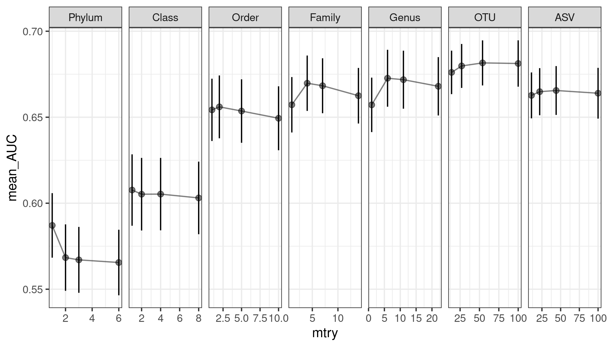
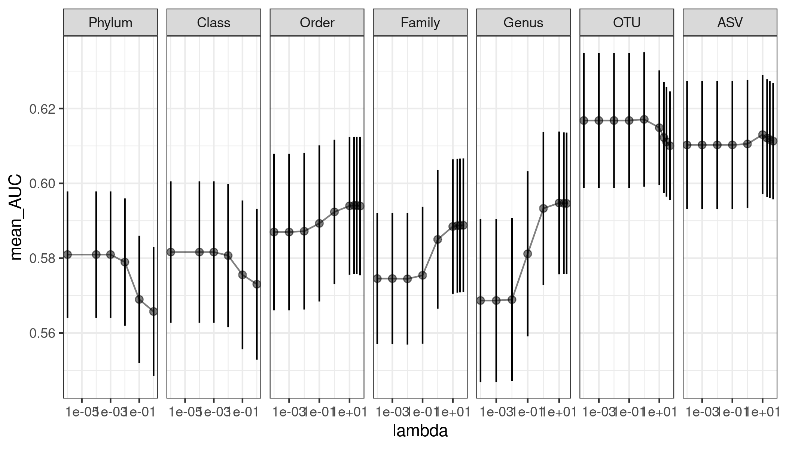
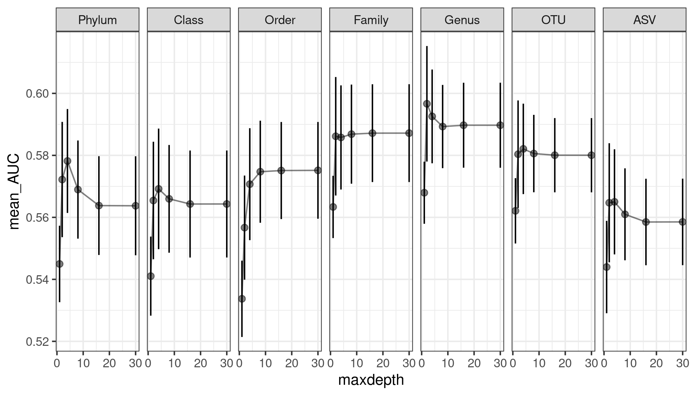
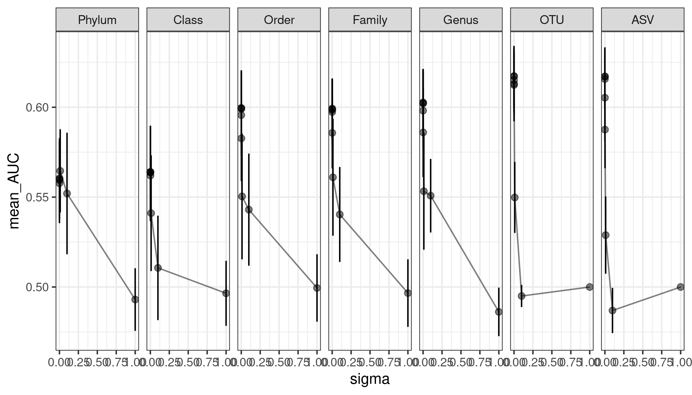

updated: `r Sys.Date()`
```{r setup_environment, include=FALSE}
knitr::opts_chunk$set(echo = FALSE,message=FALSE)

library(tidyverse)
library(knitr)
library(kableExtra)
library(ggpubr)
library(nationalparkcolors)
library(data.table)
library(cowplot)

# Variables
models <- c("rf","glmnet","xgbTree","svmRadial","rpart2")
levels <- c("phylum","class","order","family","genus","otu","asv")
levels_names <- c("Phylum","Class","Order","Family","Genus","OTU","ASV")
pal <- park_palette("Everglades",length(models))
names(pal) <- models
pal2 <- park_palette("Everglades",length(models))
names(pal2) <- c("Random Forest","Logistic Regression","XGBoost","SVM Radial","Decision Tree")

# Generate dataframe of all results and tables of the median cv and test AUCs
full_df <- NULL
auc_df <- NULL
cv_table <- tibble(level=c("phylum","class","order","family","genus","otu","asv"))
t_table <- tibble(level=c("phylum","class","order","family","genus","otu","asv"))

for( m in models ){
  phylum <- read_csv(paste0("../data/process/combined-phylum-",m,".csv")) %>% 
    mutate(level="phylum")
  class <- read_csv(paste0("../data/process/combined-class-",m,".csv")) %>% 
    mutate(level="class")
  order <- read_csv(paste0("../data/process/combined-order-",m,".csv")) %>% 
    mutate(level="order")
  family <- read_csv(paste0("../data/process/combined-family-",m,".csv")) %>% 
    mutate(level="family")
  genus <- read_csv(paste0("../data/process/combined-genus-",m,".csv")) %>%
    mutate(level="genus")
  otu <- read_csv(paste0("../data/process/combined-otu-",m,".csv")) %>%
    mutate(level="otu")
  asv <- read_csv(paste0("../data/process/combined-asv-",m,".csv")) %>%
    mutate(level="asv")
  
  model_df <- bind_rows(phylum,class,order,family,genus,otu,asv)
    
  full_df <- bind_rows(full_df,model_df)
  
  m_auc.df <- select(model_df,cv_metric_AUC,AUC,method,level) %>% 
    rename(test_AUC=AUC) %>% 
    pivot_longer(cols = c("cv_metric_AUC","test_AUC"),names_to="auc_type",values_to="AUC")
  
  m_auc.df$level <- factor(m_auc.df$level,levels=c("phylum","class","order","family","genus","otu","asv"))
  
  auc_df <- bind_rows(auc_df,m_auc.df)
  
  cv_med <- m_auc.df %>%
    filter(auc_type == "cv_metric_AUC") %>%
    group_by(level) %>% 
    summarise(!!m := median(AUC))
  
  t_med <- m_auc.df %>% 
    filter(auc_type == "test_AUC") %>%
    group_by(level) %>% 
    summarise(!!m := median(AUC))
      
  cv_table <- inner_join(cv_table,cv_med,by="level")
  t_table <- inner_join(t_table,t_med,by="level")
}

write_csv(t_table,"./figures/median_test_auc.csv")

#compare two models levels within a taxonomic level
p.table.level <- read_csv("../analysis/pvalues_by_level.csv")
#compare two taxonomic levels within a model type
p.table.model <- read_csv("../analysis/pvalues_by_model.csv")


```

## Table of Contents
- [Input data overview](#input-data-overview)
- [Hyperparameter Performance](#hyperparameter-performance)
- [Model Performance](#model-performance)
- [DADA2 Comparison](#dada2-comparison)

## Input data overview

To total number of samples and features before and after preprocessing for each taxnomic level. 
```{r input}

input <- read_csv("../analysis/input_values.csv")

kable(input)
```

## Hyperparameter Performance

Plots of HP performance for each model/taxonomic level

### Random Forest
The default hyperparameter (mtry) selection for RF is:

1. sqrt_features / 2
1. sqrt_features
1. sqrt_features * 2

Based on previous results, I added mtry=1 for Phylum through Genus levels and mtry=100 for OTU and ASV levels. This set of hyperparameters seems to cover the optimal range for each taxonomic level. 

  

### Logistic Regression

Two metrics: alpha and lambda  
By default alpha is set to zero (for L2 regularization) and lambda values are: 1e-04, 1e-03, 1e-02, 1e-01, 1e+00, 1e+01
I added 1e-05 as a lambda value for phylum and class, and higher values of lambda for the rest



### Decision Tree

The default hyperparameters were retained for decision tree (maxdepth = 1  2  4  8 16 30). It would not allow larger maxdepth than 30.

 

### XGBoost

(needs adjustment)

### SVM Radial



## Model Performance

```{r plot_by_method, echo=F,message=F,fig.height = 3.5, fig.width = 10, fig.align = "center"}

df_by_method <- full_df %>% 
  select(cv_metric_AUC,AUC,method,level) %>% 
  rename(test_AUC=AUC,cv_AUC=cv_metric_AUC) %>% 
  pivot_longer(cols=c("cv_AUC","test_AUC"),names_to="auc_type",values_to="AUC")

df_by_method$method <- factor(df_by_method$method,
                        levels=c("rf","glmnet","xgbTree","svmRadial","rpart2"),
                        labels=c("Random Forest","Logistic Regression","XGBoost","SVM Radial","Decision Tree"))

ggplot(df_by_method,aes(x=factor(level,
                            levels=c("phylum","class","order","family","genus","otu","asv"),
                            labels=c("Phylum","Class","Order","Family","Genus","OTU","ASV")),
                   y=AUC, fill=auc_type)) + 
    geom_hline(yintercept = 0.5,color="grey",lty="dashed") +
    geom_boxplot(notch = TRUE) + 
    facet_grid(.~method) + 
    theme_bw() + xlab("") + ylab("AUROC") +
    theme(legend.position ="top",
          axis.text.x = element_text(angle = 45,hjust = 1)) 
ggsave("./figures/performance_by_method.png")
```

```{r plot_by_level, echo=FALSE, message=FALSE,fig.height = 6, fig.width = 10, fig.align = "center"}
df_by_level <- full_df %>% 
  select(cv_metric_AUC,AUC,method,level) %>% 
  rename(test_AUC=AUC,cv_AUC=cv_metric_AUC) %>% 
  pivot_longer(cols=c("cv_AUC","test_AUC"),names_to="auc_type",values_to="AUC") %>% 
  mutate(level=factor(level,levels=c("phylum","class","order","family","genus","otu","asv"),
                            labels=c("Phylum","Class","Order","Family","Genus","OTU","ASV")),
         method=factor(method,levels=c("rf","glmnet","xgbTree","svmRadial","rpart2"),
                       labels=c("Random Forest","Logistic Regression","XGBoost","SVM Radial","Decision Tree")))
                       
ggplot(df_by_level,aes(x=method, y=AUC, fill=auc_type)) + 
  geom_hline(yintercept = 0.5,color="grey",lty="dashed") +
  geom_boxplot(notch = TRUE) + 
  facet_wrap(.~level,nrow = 2) + 
  theme_bw() + xlab("") + ylab("AUROC") + 
  theme(legend.position ="top",
        axis.text.x = element_text(angle = 45,hjust = 1)) 
ggsave("./figures/performance_by_tax.png")

```


```{r plot_all, echo=F, message=F, out.width="100%",fig.height=4}
df_all <- full_df %>% 
  select(cv_metric_AUC,AUC,method,level) %>% 
  rename(test_AUC=AUC,cv_AUC=cv_metric_AUC) %>% 
  pivot_longer(cols=c("cv_AUC","test_AUC"),names_to="auc_type",values_to="AUC") %>% 
  mutate(level=factor(level,levels=c("phylum","class","order","family","genus","otu","asv"),
                            labels=c("Phylum","Class","Order","Family","Genus","OTU","ASV")),
         method=factor(method,levels=c("rf","glmnet","xgbTree","svmRadial","rpart2"),
                       labels=c("Random Forest","Logistic Regression","XGBoost","SVM Radial","Decision Tree")))

df_all %>% 
  filter(auc_type == "test_AUC") %>% 
  ggplot(aes(x=level,y=AUC,fill=method)) + 
    geom_hline(yintercept = 0.5,color="grey",lty="dashed") +
    geom_boxplot(notch = TRUE) + 
    theme_bw() + xlab("") + ylab("AUROC") + 
    theme(legend.position ="top",
          axis.text.x = element_text(angle = 45,hjust = 1)) +
    scale_fill_manual(values=pal2,name="Model")
ggsave("./figures/all_model_level.png")
```


### DADA2 Comparison

```{r dada2_input}

#mothur and dada2 input values
input_data <- bind_rows(read_csv("../analysis/input_values.csv"),
                        read_csv("../data/dada2/process/summary_input_values.csv"))

kable(input_data) 
```


### Random Forest Model Performance with Significance

Random Forest on OTU level data yields the highest median AUC, followed by Family, Genus, and ASV. While the OTU AUC is not significantly higher than that of Family or Genus level, it is significantly higher than ASV.

<div class = "row">
<div class = "col-md-6">
```{r rf_table,echo=FALSE}
t_table %>%
  select(level,rf) %>% 
  mutate(rf=round(rf,digits = 3)) %>% 
  rename("Median AUC"=rf,"Level"=level) %>% 
  kable() %>%
  kable_styling(bootstrap_options = "striped", full_width = FALSE, position="center")
```

</div>

<div class = "col-md-6">
```{r rf_plot,echo=F,message=F}
m <- "Random Forest"

sub_df <- auc_df %>% 
  mutate(level=factor(level,levels=c("phylum","class","order","family","genus","otu","asv"),
                       labels=c("Phylum","Class","Order","Family","Genus","OTU","ASV")),
         method=factor(method,levels=c("rf","glmnet","xgbTree","svmRadial","rpart2"),
                       labels=c("Random Forest","Logistic Regression","XGBoost","SVM Radial","Decision Tree"))) %>% 
  filter(method==m & auc_type=="test_AUC")

sub_stats <- p.table.model %>% 
   mutate(level1=factor(level1,levels=c("phylum","class","order","family","genus","otu","asv"),
                            labels=c("Phylum","Class","Order","Family","Genus","OTU","ASV")),
          level2=factor(level2,levels=c("phylum","class","order","family","genus","otu","asv"),
                            labels=c("Phylum","Class","Order","Family","Genus","OTU","ASV")),
         model=factor(model,levels=c("rf","glmnet","xgbTree","svmRadial","rpart2"),
                       labels=c("Random Forest","Logistic Regression","XGBoost","SVM Radial","Decision Tree"))) %>% 
  filter(model==m) %>% 
  mutate(sig=case_when(p_value >= 0.05 ~ "NS",
                       TRUE ~ "*")) %>% 
  filter(sig=="NS")

sub_stats <- sub_stats %>% 
  mutate(y.position=seq.int(0.85,1.05,length.out = nrow(sub_stats))) %>% 
  rename(group1=level1,group2=level2) 

ggplot(sub_df,aes(x=level,y=AUC)) + 
  geom_hline(yintercept = 0.5,color="grey",lty="dashed") +
  geom_boxplot(aes(fill=method),notch = T) +
  scale_fill_manual(values = pal2[m]) + 
  scale_y_continuous(limits=c(0.2,1.05)) +
  theme_bw() + xlab("") + ylab("AUROC") +
  theme(legend.position ="none",
        axis.text.x = element_text(angle = 45,hjust = 1),
        panel.grid.major.x = element_blank(),
        axis.text = element_text(size=14)) +
  ggtitle(m) +
  stat_summary(fun = mean, color="white",geom = "point", shape = 18, size = 3,show.legend = FALSE) +
  stat_pvalue_manual(sub_stats,label="sig")
ggsave("./figures/rf_with_stats.png",width = 5,height=4,units="in")

```
</div>
</div>

### Logistic Regression Model Performance with Significance

<div class = "row">
<div class = "col-md-6">
```{r glmnet_table,echo=FALSE}
t_table %>%
  select(level,glmnet) %>% 
  mutate(glmnet=round(glmnet,digits = 3)) %>% 
  rename("Median AUC"=glmnet,"Level"=level) %>% 
  kable() %>%
  kable_styling(bootstrap_options = "striped", full_width = FALSE, position="center")
```
</div>

<div class = "col-md-6">
```{r glmnet_plot,echo=F,message=F}
## glmnet Model Performance
m <- "Logistic Regression"

sub_df <- auc_df %>% 
  mutate(level=factor(level,levels=c("phylum","class","order","family","genus","otu","asv"),
                       labels=c("Phylum","Class","Order","Family","Genus","OTU","ASV")),
         method=factor(method,levels=c("rf","glmnet","xgbTree","svmRadial","rpart2"),
                       labels=c("Random Forest","Logistic Regression","XGBoost","SVM Radial","Decision Tree"))) %>% 
  filter(method==m & auc_type=="test_AUC")

sub_stats <- p.table.model %>% 
   mutate(level1=factor(level1,levels=c("phylum","class","order","family","genus","otu","asv"),
                            labels=c("Phylum","Class","Order","Family","Genus","OTU","ASV")),
          level2=factor(level2,levels=c("phylum","class","order","family","genus","otu","asv"),
                            labels=c("Phylum","Class","Order","Family","Genus","OTU","ASV")),
         model=factor(model,levels=c("rf","glmnet","xgbTree","svmRadial","rpart2"),
                       labels=c("Random Forest","Logistic Regression","XGBoost","SVM Radial","Decision Tree"))) %>% 
  filter(model==m) %>% 
  mutate(sig=case_when(p_value >= 0.05 ~ "NS",
                       TRUE ~ "*")) %>% 
  filter(sig=="NS")

sub_stats <- sub_stats %>% 
  mutate(y.position=seq.int(0.85,1.05,length.out = nrow(sub_stats))) %>% 
  rename(group1=level1,group2=level2) 

ggplot(sub_df,aes(x=level,y=AUC)) + 
  geom_hline(yintercept = 0.5,color="grey",lty="dashed") +
  geom_boxplot(aes(fill=method),notch = T) +
  scale_fill_manual(values = pal2[m]) + 
  scale_y_continuous(limits=c(0.2,1.05)) +
  theme_bw() + xlab("") + ylab("AUROC") +
  theme(legend.position ="none",
        axis.text.x = element_text(angle = 45,hjust = 1),
        panel.grid.major.x = element_blank(),
        axis.text = element_text(size=14)) +
  ggtitle(m) +
  stat_summary(fun = mean, color="white",geom = "point", shape = 18, size = 3,show.legend = FALSE) +
  stat_pvalue_manual(sub_stats,label="sig")
ggsave("./figures/glmnet_with_stats.png",width = 5,height=4,units="in")

```
</div>
</div>

### Decision Tree Model Performance with Significance

<div class = "row">
<div class = "col-md-6">
```{r rpart2_table,echo=FALSE}
t_table %>%
  select(level,rpart2) %>% 
  mutate(rpart2=round(rpart2,digits = 3)) %>% 
  rename("Median AUC"=rpart2,"Level"=level) %>% 
  kable() %>%
  kable_styling(bootstrap_options = "striped", full_width = FALSE, position="center")
```
</div>

<div class = "col-md-6">
```{r rpart2_plot,echo=F,message=F}
## rpart2 Model Performance
m <- "Decision Tree"

sub_df <- auc_df %>% 
  mutate(level=factor(level,levels=c("phylum","class","order","family","genus","otu","asv"),
                       labels=c("Phylum","Class","Order","Family","Genus","OTU","ASV")),
         method=factor(method,levels=c("rf","glmnet","xgbTree","svmRadial","rpart2"),
                       labels=c("Random Forest","Logistic Regression","XGBoost","SVM Radial","Decision Tree"))) %>% 
  filter(method==m & auc_type=="test_AUC")

sub_stats <- p.table.model %>% 
   mutate(level1=factor(level1,levels=c("phylum","class","order","family","genus","otu","asv"),
                            labels=c("Phylum","Class","Order","Family","Genus","OTU","ASV")),
          level2=factor(level2,levels=c("phylum","class","order","family","genus","otu","asv"),
                            labels=c("Phylum","Class","Order","Family","Genus","OTU","ASV")),
         model=factor(model,levels=c("rf","glmnet","xgbTree","svmRadial","rpart2"),
                       labels=c("Random Forest","Logistic Regression","XGBoost","SVM Radial","Decision Tree"))) %>% 
  filter(model==m) %>% 
  mutate(sig=case_when(p_value >= 0.05 ~ "NS",
                       TRUE ~ "*")) %>% 
  filter(sig=="NS")

sub_stats <- sub_stats %>% 
  mutate(y.position=seq.int(0.85,1.05,length.out = nrow(sub_stats))) %>% 
  rename(group1=level1,group2=level2) 

ggplot(sub_df,aes(x=level,y=AUC)) + 
  geom_hline(yintercept = 0.5,color="grey",lty="dashed") +
  geom_boxplot(aes(fill=method),notch = T) +
  scale_fill_manual(values = pal2[m]) + 
  scale_y_continuous(limits=c(0.2,1.05)) +
  theme_bw() + xlab("") + ylab("AUROC") +
  theme(legend.position ="none",
        axis.text.x = element_text(angle = 45,hjust = 1),
        panel.grid.major.x = element_blank(),
        axis.text = element_text(size=14)) +
  ggtitle(m) +
  stat_summary(fun = mean, color="white",geom = "point", shape = 18, size = 3,show.legend = FALSE) +
  stat_pvalue_manual(sub_stats,label="sig")
ggsave("./figures/rpart2_with_stats.png",width = 5,height=4,units="in")

```
</div>
</div>

### SVM Radial

### XGBTree

## Feature Importance
The mikropml packages includes an option for finding [feature importance](http://www.schlosslab.org/mikropml/reference/get_feature_importance.html) using a permutation method. This significantly increases the time to run the models. The function permutes each model feature (e.g. genus) and recalulates the AUC with that feature permuted. The outputs are the permuted AUC value and the difference between this AUC value and the actual AUC value. Larger positive differences can be interpreted as being more important since the AUC value is smaller when this feature is permuted. 

The importance values are all from the Random Forest model.
