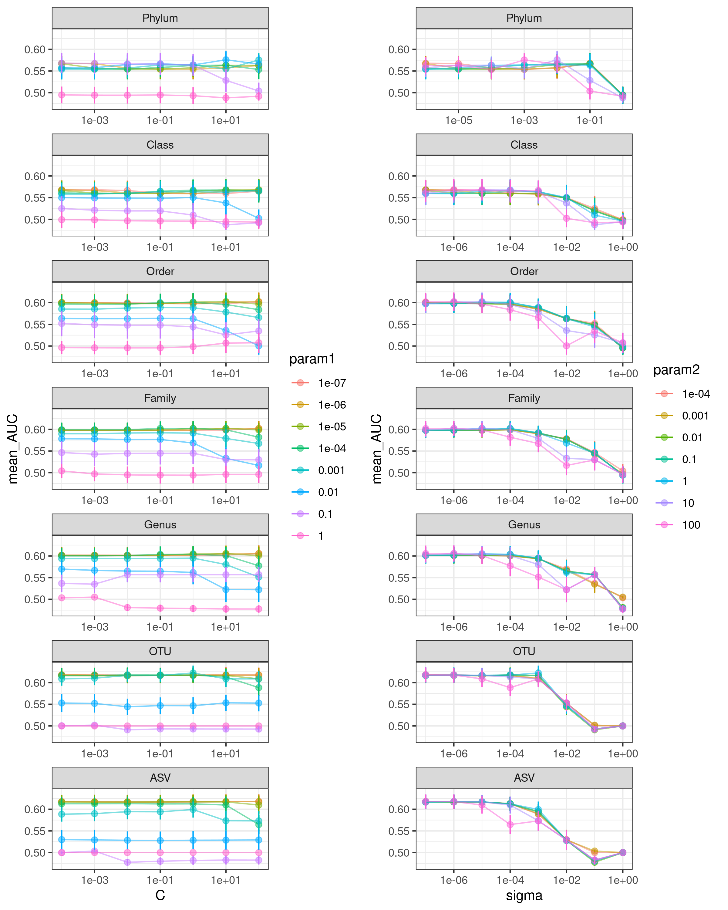

updated: `r Sys.Date()`

```{r setup_environment, include=FALSE}
knitr::opts_chunk$set(echo = FALSE,message=FALSE)
options(scipen=999)

library(tidyverse)
library(knitr)
library(kableExtra)
library(ggpubr)
library(nationalparkcolors)
library(data.table)
library(cowplot)

#given a number, adds correct commas
set_commas <- function(num){
  
}
```

```{r data_setup}
# Variables
models <- c("rf","glmnet","xgbTree","svmRadial","rpart2")
levels <- c("phylum","class","order","family","genus","otu","asv")
levels_names <- c("Phylum","Class","Order","Family","Genus","OTU","ASV")
pal <- park_palette("Everglades",length(models))
names(pal) <- models
pal2 <- park_palette("Everglades",length(models))
names(pal2) <- c("Random Forest","Logistic Regression","XGBoost","SVM Radial","Decision Tree")

# Generate dataframe of all results and tables of the median cv and test AUCs
full_df <- NULL
auc_df <- NULL
cv_table <- tibble(level=c("phylum","class","order","family","genus","otu","asv"))
t_table <- tibble(level=c("phylum","class","order","family","genus","otu","asv"))

for( m in models ){
  phylum <- read_csv(paste0("../data/process/combined-phylum-",m,".csv"),
                     col_types = c(method = col_character(),.default=col_double())) %>% 
    mutate(level="phylum")
  class <- read_csv(paste0("../data/process/combined-class-",m,".csv"),
                     col_types = c(method = col_character(),.default=col_double())) %>% 
    mutate(level="class")
  order <- read_csv(paste0("../data/process/combined-order-",m,".csv"),
                     col_types = c(method = col_character(),.default=col_double())) %>% 
    mutate(level="order")
  family <- read_csv(paste0("../data/process/combined-family-",m,".csv"),
                     col_types = c(method = col_character(),.default=col_double())) %>% 
    mutate(level="family")
  genus <- read_csv(paste0("../data/process/combined-genus-",m,".csv"),
                     col_types = c(method = col_character(),.default=col_double())) %>%
    mutate(level="genus")
  otu <- read_csv(paste0("../data/process/combined-otu-",m,".csv"),
                     col_types = c(method = col_character(),.default=col_double())) %>%
    mutate(level="otu")
  asv <- read_csv(paste0("../data/process/combined-asv-",m,".csv"),
                     col_types = c(method = col_character(),.default=col_double())) %>%
    mutate(level="asv")
  
  model_df <- bind_rows(phylum,class,order,family,genus,otu,asv)
    
  full_df <- bind_rows(full_df,model_df)
  
  m_auc.df <- select(model_df,cv_metric_AUC,AUC,method,level) %>% 
    rename(test_AUC=AUC) %>% 
    pivot_longer(cols = c("cv_metric_AUC","test_AUC"),names_to="auc_type",values_to="AUC")
  
  m_auc.df$level <- factor(m_auc.df$level,levels=c("phylum","class","order","family","genus","otu","asv"))
  
  auc_df <- bind_rows(auc_df,m_auc.df)
  
  cv_med <- m_auc.df %>%
    filter(auc_type == "cv_metric_AUC") %>%
    group_by(level) %>% 
    summarise(!!m := median(AUC),.groups = 'drop') 
  
  t_med <- m_auc.df %>% 
    filter(auc_type == "test_AUC") %>%
    group_by(level) %>% 
    summarise(!!m := median(AUC),.groups = 'drop') 
      
  cv_table <- inner_join(cv_table,cv_med,by="level")
  t_table <- inner_join(t_table,t_med,by="level")
}

write_csv(t_table,"./figures/median_test_auc.csv")

#compare two models levels within a taxonomic level
p.table.level <- read_csv("../analysis/pvalues_by_level.csv",
                     col_types = c(p_value = col_double(),.default=col_character()))
#compare two taxonomic levels within a model type
p.table.model <- read_csv("../analysis/pvalues_by_model.csv",
                     col_types = c(p_value = col_double(),.default=col_character()))


```

## Table of Contents

-   [Input data overview](#input-data-overview)

-   [Hyperparameter Performance](#hyperparameter-performance)

-   [Model Performance](#model-performance)

    -   [Random Forest](#random-forest-model-performance-with-significance)

-   [DADA2 Comparison](#dada2-comparison)

-   [Feature Importance](#feature-importance)

-   [Prevalence](#prevalence)

## Input data overview {#input-data-overview}

To total number of samples and features before and after preprocessing for each taxnomic level.

```{r input}

input <- read_csv("../analysis/input_values.csv",
                  col_types = c(level = col_character(), .default = col_double()))

kable(input)
```

## Hyperparameter Performance {#hyperparameter-performance}

Plots of HP performance for each model/taxonomic level

### Random Forest

The default hyperparameter (mtry) selection for RF is:

1.  sqrt_features / 2
2.  sqrt_features
3.  sqrt_features \* 2

Based on previous results, I added mtry=1 for Phylum through Genus levels and mtry=100 for OTU and ASV levels. This set of hyperparameters seems to cover the optimal range for each taxonomic level.


### Logistic Regression

Two metrics: alpha and lambda\
By default alpha is set to zero (for L2 regularization) and lambda values are: 1e-04, 1e-03, 1e-02, 1e-01, 1e+00, 1e+01 I added 1e-05 as a lambda value for phylum and class, and higher values of lambda for the rest


### Decision Tree

The default hyperparameters were retained for decision tree (maxdepth = 1 2 4 8 16 30). It would not allow larger maxdepth than 30.


### XGBoost

(needs adjustment)

### SVM Radial



## Model Performance {#model-performance}

```{r plot_by_method, echo=F,message=F,fig.height = 3.5, fig.width = 10, fig.align = "center"}

df_by_method <- full_df %>% 
  select(cv_metric_AUC,AUC,method,level) %>% 
  rename(test_AUC=AUC,cv_AUC=cv_metric_AUC) %>% 
  pivot_longer(cols=c("cv_AUC","test_AUC"),names_to="auc_type",values_to="AUC")

df_by_method$method <- factor(df_by_method$method,
                        levels=c("rf","glmnet","xgbTree","svmRadial","rpart2"),
                        labels=c("Random Forest","Logistic Regression","XGBoost","SVM Radial","Decision Tree"))

ggplot(df_by_method,aes(x=factor(level,
                            levels=c("phylum","class","order","family","genus","otu","asv"),
                            labels=c("Phylum","Class","Order","Family","Genus","OTU","ASV")),
                   y=AUC, fill=auc_type)) + 
    geom_hline(yintercept = 0.5,color="grey",lty="dashed") +
    geom_boxplot() + 
    facet_grid(.~method) + 
    theme_bw() + xlab("") + ylab("AUROC") +
    theme(legend.position ="top",
          axis.text.x = element_text(angle = 45,hjust = 1)) 
ggsave("./figures/performance_by_method.png")
```

```{r plot_by_level, echo=FALSE, message=FALSE,fig.height = 6, fig.width = 10, fig.align = "center"}
df_by_level <- full_df %>% 
  select(cv_metric_AUC,AUC,method,level) %>% 
  rename(test_AUC=AUC,cv_AUC=cv_metric_AUC) %>% 
  pivot_longer(cols=c("cv_AUC","test_AUC"),names_to="auc_type",values_to="AUC") %>% 
  mutate(level=factor(level,levels=c("phylum","class","order","family","genus","otu","asv"),
                            labels=c("Phylum","Class","Order","Family","Genus","OTU","ASV")),
         method=factor(method,levels=c("rf","glmnet","xgbTree","svmRadial","rpart2"),
                       labels=c("Random Forest","Logistic Regression","XGBoost","SVM Radial","Decision Tree")))
                       
ggplot(df_by_level,aes(x=method, y=AUC, fill=auc_type)) + 
  geom_hline(yintercept = 0.5,color="grey",lty="dashed") +
  geom_boxplot() + 
  facet_wrap(.~level,nrow = 2) + 
  theme_bw() + xlab("") + ylab("AUROC") + 
  theme(legend.position ="top",
        axis.text.x = element_text(angle = 45,hjust = 1)) 
ggsave("./figures/performance_by_tax.png")

```

```{r plot_all, echo=F, message=F, out.width="100%",fig.height=4}
df_all <- full_df %>% 
  select(cv_metric_AUC,AUC,method,level) %>% 
  rename(test_AUC=AUC,cv_AUC=cv_metric_AUC) %>% 
  pivot_longer(cols=c("cv_AUC","test_AUC"),names_to="auc_type",values_to="AUC") %>% 
  mutate(level=factor(level,levels=c("phylum","class","order","family","genus","otu","asv"),
                            labels=c("Phylum","Class","Order","Family","Genus","OTU","ASV")),
         method=factor(method,levels=c("rf","glmnet","xgbTree","svmRadial","rpart2"),
                       labels=c("Random Forest","Logistic Regression","XGBoost","SVM Radial","Decision Tree")))

df_all %>% 
  filter(auc_type == "test_AUC") %>% 
  ggplot(aes(x=level,y=AUC,fill=method)) + 
    geom_hline(yintercept = 0.5,color="grey",lty="dashed") +
    geom_boxplot(alpha=0.9) + 
    theme_bw() + xlab("") + ylab("AUROC") + 
    theme(legend.position ="top",
          axis.text.x = element_text(angle = 0),
          axis.text = element_text(size=14)) +
    scale_fill_manual(values=pal2,name="Model") #+
  #guides(fill=guide_legend(nrow=2))
ggsave("./figures/all_model_level.png",width = 7,height=4,units="in")
```

### DADA2 Comparison {#dada2-comparison}

```{r dada2_input}

#mothur and dada2 input values
input_data <- bind_rows(read_csv("../analysis/input_values.csv",
                                 col_types = c(level = col_character(), .default = col_double())),
                        read_csv("../data/dada2/process/summary_input_values.csv",
                                 col_types = c(level = col_character(), .default = col_double())))

```

Since there are some that believe ASVs generated by Mothur are not as good as ASVs generated by DADA2, I ran a comparison. I used DADA2 (v1.18.0) to generate ASVs and ran them through the same mikropml model pipeline. I ran dada(..., pool=T) to caputure more rare ASVs and subsampled to XX reads after processing.

Below is a summary table of the number of features at each level. Interestingly there are only `r formatC(input_data %>% filter(level=="dada2") %>% pull(n_features),big.mark = ",",format="f",digits=0)` ASVs identified with DADA2 compared to `r formatC(input_data %>% filter(level=="asv") %>% pull(n_features),big.mark = ",",format="f",digits=0)` with Mothur. After preprocessing there are just `r input_data %>% filter(level=="dada2") %>% pull(n_features_preproc)` ASVs, about half of what we find with Mothur.

```{r dada2_table}
kable(input_data) %>% 
  kable_styling(bootstrap_options = "striped")
```

```{r dada2_auc}

mothur_df <- full_df %>% 
  filter(level=="asv") %>% 
  mutate(type="Mothur")

mothur_auc_df <- auc_df %>% 
  filter(level=="asv") %>% 
  mutate(type="Mothur")
  
dada2_df <- NULL
dada2_auc_df <- NULL
for( m in models ){
  asv <- read_csv(paste0("../data/dada2/process/combined-dada2-",m,".csv"),
                     col_types = c(method = col_character(),.default=col_double())) %>%
    mutate(type="DADA2")
  dada2_df <- bind_rows(dada2_df,asv)
    
  m_auc.df <- select(asv,cv_metric_AUC,AUC,method,type) %>% 
    rename(test_AUC=AUC) %>% 
    pivot_longer(cols = c("cv_metric_AUC","test_AUC"),names_to="auc_type",values_to="AUC")
  
  dada2_auc_df <- bind_rows(dada2_auc_df,m_auc.df)
}

md_df <- bind_rows(mothur_df,dada2_df)

md_auc_df <- bind_rows(mothur_auc_df,dada2_auc_df)


```

```{r dada2_stats}
dada2_p_level <- read.csv("../data/dada2/analysis/dada2_pvalues_by_level.csv")
dada2_p_model <- read.csv("../data/dada2/analysis/dada2_pvalues_by_model.csv")
```

```{r dada2_plot_auc,out.width="50%"}
mod_md_df <- md_df %>% 
  select(cv_metric_AUC,AUC,method,level,type) %>% 
  rename(test_AUC=AUC,cv_AUC=cv_metric_AUC) %>% 
  pivot_longer(cols=c("cv_AUC","test_AUC"),names_to="auc_type",values_to="AUC") %>% 
  mutate(method=factor(method,levels=c("rf","glmnet","xgbTree","svmRadial","rpart2"),
                       labels=c("Random Forest","Logistic Regression","XGBoost","SVM Radial","Decision Tree")))

mod_md_df %>% 
  filter(type=="DADA2") %>% 
  ggplot(aes(x=method, y=AUC, fill=auc_type)) + 
    geom_hline(yintercept = 0.5,color="grey",lty="dashed") +
    geom_boxplot() + 
    theme_bw() + xlab("") + ylab("AUROC") + 
    theme(legend.position ="top",
          axis.text.x = element_text(angle = 45,hjust = 1)) +
    ggtitle("DADA2 ASV Model Performance across Models")

mod_md_df %>% 
  ggplot(aes(x=type, y=AUC, fill=auc_type)) + 
    geom_hline(yintercept = 0.5,color="grey",lty="dashed") +
    geom_boxplot() + 
    facet_grid(.~method) +
    theme_bw() + xlab("") + ylab("AUROC") + 
    theme(legend.position ="top",
          axis.text.x = element_text(angle = 45,hjust = 1)) +
    ggtitle("DADA2 vs Mothur ASV Model Performance")

```

```{r dada2_plot_auc_wstat,out.width="50%"}

#subset to just test data
mod_md_auc_df <- md_auc_df %>% 
  filter(auc_type=="test_AUC") %>% 
  mutate(method=factor(method,levels=c("rf","glmnet","xgbTree","svmRadial","rpart2"),
                       labels=c("Random Forest","Logistic Regression","XGBoost","SVM Radial","Decision Tree")))

#compare different models with DADA2 ASVs
sub_stats_level <- dada2_p_level %>% 
  mutate(level=factor(level,levels=c("asv","dada2"),
                            labels=c("Mothur","DADA2")),
         model1=factor(model1,levels=c("rf","glmnet","xgbTree","svmRadial","rpart2"),
                       labels=c("Random Forest","Logistic Regression","XGBoost","SVM Radial","Decision Tree")),
         model2=factor(model2,levels=c("rf","glmnet","xgbTree","svmRadial","rpart2"),
                       labels=c("Random Forest","Logistic Regression","XGBoost","SVM Radial","Decision Tree"))) %>% 
  mutate(sig=case_when(p_value >= 0.05 ~ "NS",
                       TRUE ~ "*")) %>% 
  mutate(y.position=seq.int(0.85,1.05,length.out = nrow(.))) %>% 
  rename(group1=model1,group2=model2) %>% 
  filter(sig=="NS")

mod_md_auc_df %>% 
  filter(type=="DADA2") %>% 
  ggplot(aes(x=method,y=AUC)) + 
    geom_hline(yintercept = 0.5,color="grey",lty="dashed") +
    geom_boxplot(aes(fill=method)) +
    scale_fill_manual(values = pal2) + 
    scale_y_continuous(limits=c(0.2,1.05)) +
    theme_bw() + xlab("") + ylab("AUROC") +
    theme(legend.position ="none",
          axis.text.x = element_text(angle = 45,hjust = 1),
          panel.grid.major.x = element_blank(),
          axis.text = element_text(size=14)) +
    ggtitle("DADA2") +
    stat_summary(fun = mean, color="white",geom = "point", shape = 18, size = 3,show.legend = FALSE) +
    stat_pvalue_manual(sub_stats_level,label="sig")


#compare Mother and DADA2 ASVs across models
sub_stats_model <- dada2_p_model %>% 
   mutate(level1=factor(level1,levels=c("asv","dada2"),
                            labels=c("Mothur","DADA2")),
          level2=factor(level2,levels=c("asv","dada2"),
                            labels=c("Mothur","DADA2")),
         model=factor(model,levels=c("rf","glmnet","xgbTree","svmRadial","rpart2"),
                       labels=c("Random Forest","Logistic Regression","XGBoost","SVM Radial","Decision Tree"))) %>% 
  mutate(sig=case_when(p_value >= 0.05 ~ "NS",
                       TRUE ~ "*")) %>% 
  #filter(sig=="NS") %>% 
  mutate(y.position=rep(0.85,length.out = nrow(.))) %>% 
  rename(group1=level1,group2=level2) %>% 
  mutate(p_value=case_when(p_value < 0.001 ~ round(p_value,digits=4),
                           TRUE ~ round(p_value,digits=2)))

mod_md_auc_df %>%
  rename(group=type,model=method) %>% 
  ggplot(aes(x=group,y=AUC,color=group)) +
    geom_hline(yintercept = 0.5,color="grey",lty="dashed") +
    geom_jitter() +
    stat_summary(fun.data=median_hilow, fun.args=0.5, geom="crossbar", width=0.5, color="black") +
    #geom_boxplot(aes(fill=model)) +
    scale_y_continuous(limits=c(0.4,0.9)) +
    theme_bw() + xlab("") + ylab("AUROC") +
    theme(legend.position ="none",
          axis.text.x = element_text(angle = 45,hjust = 1),
          panel.grid.major.x = element_blank(),
          axis.text = element_text(size=14)) +
    ggtitle("DADA2 v Mothur ASVs") +
    facet_grid(~model) +
    stat_pvalue_manual(sub_stats_model,label="p_value")


```

```{r dada2_all, echo=F, message=F, out.width="100%",fig.height=3}
dada2_auc_df %>% 
  rename(level=type) %>% 
  bind_rows(auc_df) %>% 
  mutate(level=factor(level,levels=c("phylum","class","order","family","genus","otu","asv","DADA2"),
                            labels=c("Phylum","Class","Order","Family","Genus","OTU","ASV","DADA2")),
         method=factor(method,levels=c("rf","glmnet","xgbTree","svmRadial","rpart2"),
                       labels=c("Random Forest","Logistic Regression","XGBoost","SVM Radial","Decision Tree"))) %>% 
  filter(auc_type == "test_AUC") %>% 
  ggplot(aes(x=level,y=AUC,fill=method)) + 
    geom_hline(yintercept = 0.5,color="grey",lty="dashed") +
    geom_boxplot() + 
    theme_bw() + xlab("") + ylab("AUROC") + 
    theme(legend.position ="top",
          axis.text.x = element_text(angle = 45,hjust = 1)) +
    scale_fill_manual(values=pal2,name="Model")
  

  
```

```{r dada2_rf_wstat}

# #subset to just test data
# mod_md_auc_df <- md_auc_df %>% 
#   filter(auc_type=="test_AUC",method=="rf") %>% 
#   mutate(method=factor(method,levels=c("rf"),
#                        labels=c("Random Forest")))
# 
# #compare different models with DADA2 ASVs
# sub_stats_dada2_rf <- dada2_p_model %>% 
#   filter(model=="rf") %>%    
#   mutate(sig=case_when(p_value >= 0.05 ~ "NS",
#                        TRUE ~ "*")) %>% 
#   mutate(y.position=seq.int(0.85,1.05,length.out = nrow(.))) %>% 
#   rename(group1=level1,group2=level2) %>% 
#   filter(sig=="NS")
# 
# mod_md_auc_df %>% 
#   filter(type=="DADA2") %>% 
#   ggplot(aes(x=method,y=AUC)) + 
#     geom_hline(yintercept = 0.5,color="grey",lty="dashed") +
#     geom_boxplot(aes(fill=method)) +
#     scale_fill_manual(values = pal2) + 
#     scale_y_continuous(limits=c(0.2,1.05)) +
#     theme_bw() + xlab("") + ylab("AUROC") +
#     theme(legend.position ="none",
#           axis.text.x = element_text(angle = 45,hjust = 1),
#           panel.grid.major.x = element_blank(),
#           axis.text = element_text(size=14)) +
#     ggtitle("DADA2") +
#     stat_summary(fun = mean, color="white",geom = "point", shape = 18, size = 3,show.legend = FALSE) +
#     stat_pvalue_manual(sub_stats_level,label="sig")
# 
# 
# #compare Mother and DADA2 ASVs across models
# sub_stats_model <- dada2_p_model %>% 
#    mutate(level1=factor(level1,levels=c("asv","dada2"),
#                             labels=c("Mothur","DADA2")),
#           level2=factor(level2,levels=c("asv","dada2"),
#                             labels=c("Mothur","DADA2")),
#          model=factor(model,levels=c("rf","glmnet","xgbTree","svmRadial","rpart2"),
#                        labels=c("Random Forest","Logistic Regression","XGBoost","SVM Radial","Decision Tree"))) %>% 
#   mutate(sig=case_when(p_value >= 0.05 ~ "NS",
#                        TRUE ~ "*")) %>% 
#   #filter(sig=="NS") %>% 
#   mutate(y.position=rep(0.85,length.out = nrow(.))) %>% 
#   rename(group1=level1,group2=level2) %>% 
#   mutate(p_value=case_when(p_value < 0.001 ~ round(p_value,digits=4),
#                            TRUE ~ round(p_value,digits=2)))
# 
# mod_md_auc_df %>%
#   rename(group=type,model=method) %>% 
#   ggplot(aes(x=group,y=AUC,color=group)) +
#     geom_hline(yintercept = 0.5,color="grey",lty="dashed") +
#     geom_jitter() +
#     stat_summary(fun.data=median_hilow, fun.args=0.5, geom="crossbar", width=0.5, color="black") +
#     #geom_boxplot(aes(fill=model)) +
#     scale_y_continuous(limits=c(0.4,0.9)) +
#     theme_bw() + xlab("") + ylab("AUROC") +
#     theme(legend.position ="none",
#           axis.text.x = element_text(angle = 45,hjust = 1),
#           panel.grid.major.x = element_blank(),
#           axis.text = element_text(size=14)) +
#     ggtitle("DADA2 v Mothur ASVs") +
#     facet_grid(~model) +
#     stat_pvalue_manual(sub_stats_model,label="p_value")


```

### Random Forest Model Performance with Significance {#random-forest-model-performance-with-significance}

Random Forest on OTU level data yields the highest median AUC, followed by Family, Genus, and ASV. While the OTU AUC is not significantly higher than that of Family or Genus level, it is significantly higher than ASV.

::: {.row}
::: {.col-md-6}
```{r rf_table,echo=FALSE}
t_table %>%
  select(level,rf) %>% 
  mutate(rf=round(rf,digits = 3)) %>% 
  rename("Median AUC"=rf,"Level"=level) %>% 
  kable() %>%
  kable_styling(bootstrap_options = "striped", full_width = FALSE, position="center")
```
:::

::: {.col-md-6}
```{r rf_plot,echo=F,message=F}
m <- "Random Forest"

sub_df <- auc_df %>% 
  mutate(level=factor(level,levels=c("phylum","class","order","family","genus","otu","asv"),
                       labels=c("Phylum","Class","Order","Family","Genus","OTU","ASV")),
         method=factor(method,levels=c("rf","glmnet","xgbTree","svmRadial","rpart2"),
                       labels=c("Random Forest","Logistic Regression","XGBoost","SVM Radial","Decision Tree"))) %>% 
  filter(method==m & auc_type=="test_AUC")

# sub_stats <- p.table.model %>% 
#    mutate(level1=factor(level1,levels=c("phylum","class","order","family","genus","otu","asv"),
#                             labels=c("Phylum","Class","Order","Family","Genus","OTU","ASV")),
#           level2=factor(level2,levels=c("phylum","class","order","family","genus","otu","asv"),
#                             labels=c("Phylum","Class","Order","Family","Genus","OTU","ASV")),
#          model=factor(model,levels=c("rf","glmnet","xgbTree","svmRadial","rpart2"),
#                        labels=c("Random Forest","Logistic Regression","XGBoost","SVM Radial","Decision Tree"))) %>% 
#   filter(model==m) %>% 
#   select(-model) %>% 
#   pivot_wider(names_from=level2,values_from=p_value) %>% 
#   column_to_rownames(var="level1")
# sub_stats <- sub_stats[levels_names[1:6],levels_names[2:7]]


# sub_stats <- sub_stats %>% 
#   mutate(y.position=seq.int(0.85,1.05,length.out = nrow(sub_stats))) %>% 
#   rename(group1=level1,group2=level2) 

ggplot(sub_df,aes(x=factor(level,levels=c("ASV", "OTU","Genus","Family","Order","Class", "Phylum")), y=AUC)) + 
#ggplot(sub_df,aes(x=level, y=AUC)) + 
  geom_jitter(aes(fill=method,color=method),height = 0, width = 0.2,shape=21) +
  stat_summary(fun.data = median_hilow,fun.args=0.5, geom="crossbar", width=0.5, color="black") +
  scale_fill_manual(values = alpha(pal2[m],0.6)) +
  scale_color_manual(values = pal2[m]) +
  scale_y_continuous(limits=c(0.45,0.87),breaks = seq(0.5,0.8,0.1),expand=c(0,0)) +
  theme_bw() + xlab("") + ylab("AUROC") +
  theme(legend.position ="none",
        #axis.text.x = element_text(angle = 45,hjust = 1),
        panel.grid.major.y = element_blank(),
        axis.text = element_text(size=14),
        axis.title = element_text(size=14)) +
  coord_flip() +
  geom_hline(yintercept = 0.5,color="grey",lty="dashed") +
  annotate("text",x=levels_names,y=rep(0.85,length(levels_names)),label=c("A","B","C","D,E","D","D","E"))
ggsave("./figures/rf_with_stats.png",width = 5,height=4,units="in")

```
:::
:::

```{r rf_wstat_options,include=F}

# OPTION 1 ------------
m <- "Random Forest"

sub_df <- auc_df %>% 
  mutate(level=factor(level,levels=c("phylum","class","order","family","genus","otu","asv"),
                       labels=c("Phylum","Class","Order","Family","Genus","OTU","ASV")),
         method=factor(method,levels=c("rf","glmnet","xgbTree","svmRadial","rpart2"),
                       labels=c("Random Forest","Logistic Regression","XGBoost","SVM Radial","Decision Tree"))) %>% 
  filter(method==m & auc_type=="test_AUC")

sub_stats <- p.table.model %>% 
   mutate(level1=factor(level1,levels=c("phylum","class","order","family","genus","otu","asv"),
                            labels=c("Phylum","Class","Order","Family","Genus","OTU","ASV")),
          level2=factor(level2,levels=c("phylum","class","order","family","genus","otu","asv"),
                            labels=c("Phylum","Class","Order","Family","Genus","OTU","ASV")),
         model=factor(model,levels=c("rf","glmnet","xgbTree","svmRadial","rpart2"),
                       labels=c("Random Forest","Logistic Regression","XGBoost","SVM Radial","Decision Tree"))) %>% 
  filter(model==m) %>% 
  mutate(sig=case_when(p_value >= 0.05 ~ "NS",
                       TRUE ~ "*")) %>% 
  filter(sig=="NS")

sub_stats <- sub_stats %>% 
  mutate(y.position=seq.int(0.85,1.05,length.out = nrow(sub_stats))) %>% 
  rename(group1=level1,group2=level2) 

ggplot(sub_df,aes(x=level,y=AUC)) + 
  geom_hline(yintercept = 0.5,color="grey",lty="dashed") +
  geom_boxplot(aes(fill=method,alpha=0.8)) +
  scale_fill_manual(values = pal2[m]) + 
  scale_y_continuous(limits=c(0.4,1.05)) +
  theme_bw() + xlab("") + ylab("AUROC") +
  theme(legend.position ="none",
        axis.text.x = element_text(angle = 45,hjust = 1),
        panel.grid.major.x = element_blank(),
        axis.text = element_text(size=14)) +
  #ggtitle(m) +
  #stat_summary(fun = mean, color="white",geom = "point", shape = 18, size = 3,show.legend = FALSE) +
  stat_pvalue_manual(sub_stats,label="sig")

# OPTION 2 ------------

ggplot(sub_df,aes(x=factor(level,levels=c("ASV", "OTU","Genus","Family","Order","Class", "Phylum")),
                           y=AUC)) + 
  #geom_jitter(aes(color=method,width=0,height=0.2)) +
  geom_boxplot(aes(fill=level,alpha=0.8)) +
  #scale_fill_manual(values = pal2[m]) +
  #scale_color_manual(values = pal2[m]) +
  #scale_x_continuous(limits=c(0.4,1)) +
  theme_bw() + xlab("") + ylab("AUROC") +
  theme(legend.position ="none",
        #axis.text.x = element_text(angle = 45,hjust = 1),
        panel.grid.major.x = element_blank(),
        axis.text = element_text(size=14)) +
  #ggtitle(m) +
  stat_pvalue_manual(sub_stats,label="sig",coord.flip = T,angle = 0,hjust=0) +
  coord_flip() +
  geom_hline(yintercept = 0.5,color="grey",lty="dashed") 

# OPTION 3 ------------

sub_df <- auc_df %>% 
  mutate(level=factor(level,levels=c("phylum","class","order","family","genus","otu","asv"),
                       labels=c("Phylum","Class","Order","Family","Genus","OTU","ASV")),
         method=factor(method,levels=c("rf","glmnet","xgbTree","svmRadial","rpart2"),
                       labels=c("Random Forest","Logistic Regression","XGBoost","SVM Radial","Decision Tree"))) %>% 
  filter(method==m & auc_type=="test_AUC")

sub_stats <- p.table.model %>% 
   mutate(level1=factor(level1,levels=c("phylum","class","order","family","genus","otu","asv"),
                            labels=c("Phylum","Class","Order","Family","Genus","OTU","ASV")),
          level2=factor(level2,levels=c("phylum","class","order","family","genus","otu","asv"),
                            labels=c("Phylum","Class","Order","Family","Genus","OTU","ASV")),
         model=factor(model,levels=c("rf","glmnet","xgbTree","svmRadial","rpart2"),
                       labels=c("Random Forest","Logistic Regression","XGBoost","SVM Radial","Decision Tree"))) %>% 
  filter(model==m) %>% 
  mutate(sig=case_when(p_value >= 0.05 ~ "NS",
                       TRUE ~ "*")) %>% 
  filter(sig=="NS")

sub_stats <- sub_stats %>% 
  #mutate(y.position=seq.int(0.85,1.05,length.out = nrow(sub_stats))) %>% 
  mutate(y.position=c(0.85,0.95,0.9,.95)) %>%
  rename(group1=level1,group2=level2) 

ggplot(sub_df,aes(x=level,y=AUC)) + 
  geom_hline(yintercept = 0.5,color="grey",lty="dashed") +
  #geom_boxplot(aes(fill=method)) +
  geom_jitter(aes(fill=method),height = 0, width = 0.2,alpha=0.8,shape=21) +
  stat_summary(fun.data = median_hilow,fun.args=0.5, geom="crossbar", width=0.5, color="black") +
  scale_fill_manual(values = pal2[m]) + 
  scale_y_continuous(limits=c(0.4,1),breaks = seq(0.4,1,0.1)) +
  theme_bw() + xlab("") + ylab("AUROC") +
  theme(legend.position ="none",
        #axis.text.x = element_text(angle = 45,hjust = 1),
        panel.grid.major.x = element_blank(),
        axis.text = element_text(size=14)) +
  #ggtitle(m) +
  #stat_summary(fun = mean, color="white",geom = "point", shape = 18, size = 3,show.legend = FALSE) +
  stat_pvalue_manual(sub_stats,label="sig")

# OPTION 4 ------------

sub_stats <- sub_stats %>% 
  #mutate(y.position=seq.int(0.85,.95,length.out = nrow(sub_stats)))
  mutate(y.position=c(0.85,0.95,0.9,.95))

ggplot(sub_df,aes(x=factor(level,levels=c("ASV", "OTU","Genus","Family","Order","Class", "Phylum")),
                           y=AUC)) + 
  geom_jitter(aes(fill=level),height = 0, width = 0.2,alpha=0.8,shape=21) +
  stat_summary(fun.data = median_hilow,fun.args=0.5, geom="crossbar", width=0.5, color="black") +
  #scale_fill_manual(values = pal2[m]) +
  #scale_color_manual(values = pal2[m]) +
  #scale_x_continuous(limits=c(0.4,1)) +
  theme_bw() + xlab("") + ylab("AUROC") +
  theme(legend.position ="none",
        #axis.text.x = element_text(angle = 45,hjust = 1),
        panel.grid.major.x = element_blank(),
        axis.text = element_text(size=14)) +
  scale_y_continuous(position = "right") +
  #ggtitle(m) +
  stat_pvalue_manual(sub_stats,label="sig",coord.flip = T,angle = 0,hjust=0) +
  coord_flip() +
  geom_hline(yintercept = 0.5,color="grey",lty="dashed") 

# OPTION 5 ------------

sub_df <- auc_df %>% 
  mutate(level=factor(level,levels=c("phylum","class","order","family","genus","otu","asv"),
                       labels=c("Phylum","Class","Order","Family","Genus","OTU","ASV")),
         method=factor(method,levels=c("rf","glmnet","xgbTree","svmRadial","rpart2"),
                       labels=c("Random Forest","Logistic Regression","XGBoost","SVM Radial","Decision Tree"))) %>% 
  filter(method==m & auc_type=="test_AUC")

sub_stats <- p.table.model %>% 
   mutate(level1=factor(level1,levels=c("phylum","class","order","family","genus","otu","asv"),
                            labels=c("Phylum","Class","Order","Family","Genus","OTU","ASV")),
          level2=factor(level2,levels=c("phylum","class","order","family","genus","otu","asv"),
                            labels=c("Phylum","Class","Order","Family","Genus","OTU","ASV")),
         model=factor(model,levels=c("rf","glmnet","xgbTree","svmRadial","rpart2"),
                       labels=c("Random Forest","Logistic Regression","XGBoost","SVM Radial","Decision Tree"))) %>% 
  filter(model==m) %>% 
  mutate(sig=case_when(p_value >= 0.05 ~ "NS",
                       TRUE ~ "*")) %>% 
  filter(sig!="NS") %>% 
  mutate(p_value_mod=case_when(p_value < 0.0001 ~ round(p_value,digits=5),
                               p_value < 0.001 ~ round(p_value,digits=4),
                               p_value < 0.01 ~ round(p_value,digits=3),
                               TRUE ~ round(p_value,digits=2)))

sub_stats <- sub_stats %>% 
  #mutate(y.position=seq.int(0.85,1.05,length.out = nrow(sub_stats))) %>% 
  mutate(y.position=c(1,1,1,1,1,
                      0.9,
                      0.95,0.95,0.95,0.95,
                      0.85,
                      1.05,1.05,1.05,1.05,1.05,1.05)) %>% 
  #mutate(y.position=c(0.85,0.95,0.9,.95)) %>%
  rename(group1=level1,group2=level2) 

ggplot(sub_df,aes(x=level,y=AUC)) + 
  geom_hline(yintercept = 0.5,color="grey",lty="dashed") +
  #geom_boxplot(aes(fill=method)) +
  geom_jitter(aes(fill=method),height = 0, width = 0.2,alpha=0.8,shape=21) +
  stat_summary(fun.data = median_hilow,fun.args=0.5, geom="crossbar", width=0.5, color="black") +
  scale_fill_manual(values = pal2[m]) + 
  scale_y_continuous(limits=c(0.4,1.05),breaks = seq(0.4,1.05,0.1)) +
  theme_bw() + xlab("") + ylab("AUROC") +
  theme(legend.position ="none",
        #axis.text.x = element_text(angle = 45,hjust = 1),
        panel.grid.major.x = element_blank(),
        axis.text = element_text(size=14)) +
  #ggtitle(m) +
  #stat_summary(fun = mean, color="white",geom = "point", shape = 18, size = 3,show.legend = FALSE) +
  #stat_pvalue_manual(sub_stats,label="p_value_mod") 
  stat_pvalue_manual(sub_stats,label="sig")
```

### Logistic Regression Model Performance with Significance

::: {.row}
::: {.col-md-6}
```{r glmnet_table,echo=FALSE}
t_table %>%
  select(level,glmnet) %>% 
  mutate(glmnet=round(glmnet,digits = 3)) %>% 
  rename("Median AUC"=glmnet,"Level"=level) %>% 
  kable() %>%
  kable_styling(bootstrap_options = "striped", full_width = FALSE, position="center")
```
:::

::: {.col-md-6}
```{r glmnet_plot,echo=F,message=F}
## glmnet Model Performance
m <- "Logistic Regression"

sub_df <- auc_df %>% 
  mutate(level=factor(level,levels=c("phylum","class","order","family","genus","otu","asv"),
                       labels=c("Phylum","Class","Order","Family","Genus","OTU","ASV")),
         method=factor(method,levels=c("rf","glmnet","xgbTree","svmRadial","rpart2"),
                       labels=c("Random Forest","Logistic Regression","XGBoost","SVM Radial","Decision Tree"))) %>% 
  filter(method==m & auc_type=="test_AUC")

sub_stats <- p.table.model %>% 
   mutate(level1=factor(level1,levels=c("phylum","class","order","family","genus","otu","asv"),
                            labels=c("Phylum","Class","Order","Family","Genus","OTU","ASV")),
          level2=factor(level2,levels=c("phylum","class","order","family","genus","otu","asv"),
                            labels=c("Phylum","Class","Order","Family","Genus","OTU","ASV")),
         model=factor(model,levels=c("rf","glmnet","xgbTree","svmRadial","rpart2"),
                       labels=c("Random Forest","Logistic Regression","XGBoost","SVM Radial","Decision Tree"))) %>% 
  filter(model==m) %>% 
  mutate(sig=case_when(p_value >= 0.05 ~ "NS",
                       TRUE ~ "*")) %>% 
  filter(sig=="NS")

sub_stats <- sub_stats %>% 
  mutate(y.position=seq.int(0.85,1.05,length.out = nrow(sub_stats))) %>% 
  rename(group1=level1,group2=level2) 

ggplot(sub_df,aes(x=level,y=AUC)) + 
  geom_hline(yintercept = 0.5,color="grey",lty="dashed") +
  geom_boxplot(aes(fill=method)) +
  scale_fill_manual(values = pal2[m]) + 
  scale_y_continuous(limits=c(0.2,1.05)) +
  theme_bw() + xlab("") + ylab("AUROC") +
  theme(legend.position ="none",
        axis.text.x = element_text(angle = 45,hjust = 1),
        panel.grid.major.x = element_blank(),
        axis.text = element_text(size=14)) +
  ggtitle(m) +
  stat_summary(fun = mean, color="white",geom = "point", shape = 18, size = 3,show.legend = FALSE) +
  stat_pvalue_manual(sub_stats,label="sig")
ggsave("./figures/glmnet_with_stats.png",width = 5,height=4,units="in")

```
:::
:::

### Decision Tree Model Performance with Significance

::: {.row}
::: {.col-md-6}
```{r rpart2_table,echo=FALSE}
t_table %>%
  select(level,rpart2) %>% 
  mutate(rpart2=round(rpart2,digits = 3)) %>% 
  rename("Median AUC"=rpart2,"Level"=level) %>% 
  kable() %>%
  kable_styling(bootstrap_options = "striped", full_width = FALSE, position="center")
```
:::

::: {.col-md-6}
```{r rpart2_plot,echo=F,message=F}
## rpart2 Model Performance
m <- "Decision Tree"

sub_df <- auc_df %>% 
  mutate(level=factor(level,levels=c("phylum","class","order","family","genus","otu","asv"),
                       labels=c("Phylum","Class","Order","Family","Genus","OTU","ASV")),
         method=factor(method,levels=c("rf","glmnet","xgbTree","svmRadial","rpart2"),
                       labels=c("Random Forest","Logistic Regression","XGBoost","SVM Radial","Decision Tree"))) %>% 
  filter(method==m & auc_type=="test_AUC")

sub_stats <- p.table.model %>% 
   mutate(level1=factor(level1,levels=c("phylum","class","order","family","genus","otu","asv"),
                            labels=c("Phylum","Class","Order","Family","Genus","OTU","ASV")),
          level2=factor(level2,levels=c("phylum","class","order","family","genus","otu","asv"),
                            labels=c("Phylum","Class","Order","Family","Genus","OTU","ASV")),
         model=factor(model,levels=c("rf","glmnet","xgbTree","svmRadial","rpart2"),
                       labels=c("Random Forest","Logistic Regression","XGBoost","SVM Radial","Decision Tree"))) %>% 
  filter(model==m) %>% 
  mutate(sig=case_when(p_value >= 0.05 ~ "NS",
                       TRUE ~ "*")) %>% 
  filter(sig=="NS")

sub_stats <- sub_stats %>% 
  mutate(y.position=seq.int(0.85,1.05,length.out = nrow(sub_stats))) %>% 
  rename(group1=level1,group2=level2) 

ggplot(sub_df,aes(x=level,y=AUC)) + 
  geom_hline(yintercept = 0.5,color="grey",lty="dashed") +
  geom_boxplot(aes(fill=method)) +
  scale_fill_manual(values = pal2[m]) + 
  scale_y_continuous(limits=c(0.2,1.05)) +
  theme_bw() + xlab("") + ylab("AUROC") +
  theme(legend.position ="none",
        axis.text.x = element_text(angle = 45,hjust = 1),
        panel.grid.major.x = element_blank(),
        axis.text = element_text(size=14)) +
  ggtitle(m) +
  stat_summary(fun = mean, color="white",geom = "point", shape = 18, size = 3,show.legend = FALSE) +
  stat_pvalue_manual(sub_stats,label="sig")
ggsave("./figures/rpart2_with_stats.png",width = 5,height=4,units="in")

```
:::
:::

### SVM Radial

::: {.row}
::: {.col-md-6}
```{r svmRadial_table,echo=FALSE}
t_table %>%
  select(level,svmRadial) %>% 
  mutate(svmRadial=round(svmRadial,digits = 3)) %>% 
  rename("Median AUC"=svmRadial,"Level"=level) %>% 
  kable() %>%
  kable_styling(bootstrap_options = "striped", full_width = FALSE, position="center")
```
:::

::: {.col-md-6}
```{r svmRadial_plot,echo=F,message=F}
## svmRadial Model Performance
m <- "SVM Radial"

sub_df <- auc_df %>% 
  mutate(level=factor(level,levels=c("phylum","class","order","family","genus","otu","asv"),
                       labels=c("Phylum","Class","Order","Family","Genus","OTU","ASV")),
         method=factor(method,levels=c("rf","glmnet","xgbTree","svmRadial","rpart2"),
                       labels=c("Random Forest","Logistic Regression","XGBoost","SVM Radial","Decision Tree"))) %>% 
  filter(method==m & auc_type=="test_AUC")

sub_stats <- p.table.model %>% 
   mutate(level1=factor(level1,levels=c("phylum","class","order","family","genus","otu","asv"),
                            labels=c("Phylum","Class","Order","Family","Genus","OTU","ASV")),
          level2=factor(level2,levels=c("phylum","class","order","family","genus","otu","asv"),
                            labels=c("Phylum","Class","Order","Family","Genus","OTU","ASV")),
         model=factor(model,levels=c("rf","glmnet","xgbTree","svmRadial","rpart2"),
                       labels=c("Random Forest","Logistic Regression","XGBoost","SVM Radial","Decision Tree"))) %>% 
  filter(model==m) %>% 
  mutate(sig=case_when(p_value >= 0.05 ~ "NS",
                       TRUE ~ "*")) %>% 
  filter(sig=="NS")

sub_stats <- sub_stats %>% 
  mutate(y.position=seq.int(0.85,1.05,length.out = nrow(sub_stats))) %>% 
  rename(group1=level1,group2=level2) 

ggplot(sub_df,aes(x=level,y=AUC)) + 
  geom_hline(yintercept = 0.5,color="grey",lty="dashed") +
  geom_boxplot(aes(fill=method)) +
  scale_fill_manual(values = pal2[m]) + 
  scale_y_continuous(limits=c(0.2,1.05)) +
  theme_bw() + xlab("") + ylab("AUROC") +
  theme(legend.position ="none",
        axis.text.x = element_text(angle = 45,hjust = 1),
        panel.grid.major.x = element_blank(),
        axis.text = element_text(size=14)) +
  ggtitle(m) +
  stat_summary(fun = mean, color="white",geom = "point", shape = 18, size = 3,show.legend = FALSE) +
  stat_pvalue_manual(sub_stats,label="sig")
ggsave("./figures/svmRadial_with_stats.png",width = 5,height=4,units="in")

```
:::
:::

### XGBTree

::: {.row}
::: {.col-md-6}
```{r xgbTree_table,echo=FALSE}
t_table %>%
  select(level,xgbTree) %>% 
  mutate(xgbTree=round(xgbTree,digits = 3)) %>% 
  rename("Median AUC"=xgbTree,"Level"=level) %>% 
  kable() %>%
  kable_styling(bootstrap_options = "striped", full_width = FALSE, position="center")
```
:::

::: {.col-md-6}
```{r xgbTree_plot,echo=F,message=F}
## XGBoost Model Performance
m <- "XGBoost"

sub_df <- auc_df %>% 
  mutate(level=factor(level,levels=c("phylum","class","order","family","genus","otu","asv"),
                       labels=c("Phylum","Class","Order","Family","Genus","OTU","ASV")),
         method=factor(method,levels=c("rf","glmnet","xgbTree","svmRadial","rpart2"),
                       labels=c("Random Forest","Logistic Regression","XGBoost","SVM Radial","Decision Tree"))) %>% 
  filter(method==m & auc_type=="test_AUC")

sub_stats <- p.table.model %>% 
   mutate(level1=factor(level1,levels=c("phylum","class","order","family","genus","otu","asv"),
                            labels=c("Phylum","Class","Order","Family","Genus","OTU","ASV")),
          level2=factor(level2,levels=c("phylum","class","order","family","genus","otu","asv"),
                            labels=c("Phylum","Class","Order","Family","Genus","OTU","ASV")),
         model=factor(model,levels=c("rf","glmnet","xgbTree","svmRadial","rpart2"),
                       labels=c("Random Forest","Logistic Regression","XGBoost","SVM Radial","Decision Tree"))) %>% 
  filter(model==m) %>% 
  mutate(sig=case_when(p_value >= 0.05 ~ "NS",
                       TRUE ~ "*")) %>% 
  filter(sig=="NS")

sub_stats <- sub_stats %>% 
  mutate(y.position=seq.int(0.85,1.05,length.out = nrow(sub_stats))) %>% 
  rename(group1=level1,group2=level2) 

ggplot(sub_df,aes(x=level,y=AUC)) + 
  geom_hline(yintercept = 0.5,color="grey",lty="dashed") +
  geom_boxplot(aes(fill=method)) +
  scale_fill_manual(values = pal2[m]) + 
  scale_y_continuous(limits=c(0.2,1.05)) +
  theme_bw() + xlab("") + ylab("AUROC") +
  theme(legend.position ="none",
        axis.text.x = element_text(angle = 45,hjust = 1),
        panel.grid.major.x = element_blank(),
        axis.text = element_text(size=14)) +
  ggtitle(m) +
  stat_summary(fun = mean, color="white",geom = "point", shape = 18, size = 3,show.legend = FALSE) +
  stat_pvalue_manual(sub_stats,label="sig")
ggsave("./figures/xgbTree_with_stats.png",width = 5,height=4,units="in")

```
:::
:::

## Feature Importance {#feature-importance}

The mikropml packages includes an option for finding [feature importance](http://www.schlosslab.org/mikropml/reference/get_feature_importance.html) using a permutation method. This significantly increases the time to run the models. The function permutes each model feature (e.g. genus) and recalculates the AUC with that feature permuted. The outputs are the permuted AUC value and the difference between this AUC value and the actual AUC value. Larger positive differences can be interpreted as being more important since the AUC value is smaller when this feature is permuted.

The importance values are all from the Random Forest model.

```{r imp_plots}
imp_plots <- list()
m="rf"
for(l in levels){
  test <- read_csv(paste0("../data/process/importance-",l,"-",m,".csv"),
                   col_types = c(perf_metric = col_double(),
                                 perf_metric_diff = col_double(),
                                 seed = col_double(),
                                 .default = col_character())) %>% 
    mutate(level := !!l)
  test_results <- read_csv(paste0("../data/process/combined-",l,"-",m,".csv"),
                           col_types = c(method = col_character(), .default = col_double())) %>% 
    mutate(level := !!l)

  test_tax <- read_tsv(paste0("../data/",l,"/crc.taxonomy"),
                   col_types = c(Size = col_double(),
                                 .default = col_character())) %>%
    mutate(level := !!l)
  
  test_merge <- test %>%
    select(perf_metric,perf_metric_diff,names,method,seed,level) %>% 
    rename(AUC=perf_metric,OTU=names,AUC_diff=perf_metric_diff) %>% 
    inner_join(test_tax,by=c("level","OTU")) %>% 
    mutate(name=paste0(Taxonomy," (",OTU,")"))

  test_quartiles <- quantile(pull(test_results,AUC))
  names(test_quartiles) <- c("q0","q1","q2","q3","q4")

  test_median <- median(pull(test_results,AUC))
  
  if(l %in% c("otu","asv")){
    imp_plots[[paste0(m,"-",l,"-1")]] <- test_merge %>% 
      mutate(OTU=reorder(OTU,desc(AUC),.fun="median")) %>% 
      ggplot(aes(x=AUC,y=OTU)) + 
        geom_point(alpha=0.5,color="lightblue") +
        stat_summary(fun = mean,geom = "point", shape = 18, size = 3,aes(color="Mean")) +
        stat_summary(fun = median,geom = "point", shape = 18, size = 3,aes(color="Median")) +
        scale_color_manual(name="",values=c("red","green")) +
        theme_bw() +
        theme(legend.position = "bottom",
              axis.text.y = element_blank()) +
        geom_vline(xintercept = test_quartiles["q1"]) +
        geom_vline(xintercept = test_quartiles["q3"]) + 
        geom_vline(xintercept = test_median,lty="dashed") +
        ggtitle(paste0(m,"-",l,": AUC ordered")) +
        xlab("Permuted AUC") + ylab("Feature")
    #ggsave(paste0("./data/analysis/exploratory3/importance_metric_",m,"_",l,".png"))
  
  imp_plots[[paste0(m,"-",l,"-2")]] <- test_merge %>% 
    mutate(OTU=reorder(OTU,AUC_diff,.fun="median")) %>% 
    ggplot(aes(x=AUC_diff,y=OTU)) + 
      geom_point(alpha=0.5,color="lightblue") +
      stat_summary(fun = mean,geom = "point", shape = 18, size = 3,aes(color="Mean")) +
      stat_summary(fun = median,geom = "point", shape = 18, size = 3,aes(color="Median")) +
      scale_color_manual(name="",values=c("red","green")) +
      geom_vline(xintercept = 0,lty="dashed",color="black") +
      theme_bw() +
      theme(legend.position = "bottom",
            axis.text.y = element_blank()) +
      ggtitle(paste0(m,"-",l,": AUC difference sorted")) +
      ylab("Feature") + xlab("AUC Difference (actual - permuted)")
    #ggsave(paste0("./data/analysis/exploratory3/importance_diff_",m,"_",l,".png"))

  }else{
    
    imp_plots[[paste0(m,"-",l,"-1")]] <- test_merge %>% 
      mutate(name=reorder(name,desc(AUC),.fun="median")) %>% 
      ggplot(aes(x=AUC,y=name)) + 
        geom_point(alpha=0.5,color="lightblue") +
        stat_summary(fun = mean,geom = "point", shape = 18, size = 3,aes(color="Mean")) +
        stat_summary(fun = median,geom = "point", shape = 18, size = 3,aes(color="Median")) +
        scale_color_manual(name="",values=c("red","green")) +
        theme_bw() +
        theme(legend.position = "bottom") +
        geom_vline(xintercept = test_quartiles["q1"]) +
        geom_vline(xintercept = test_quartiles["q3"]) + 
        geom_vline(xintercept = test_median,lty="dashed") +
        ggtitle(paste0(m,"-",l,": AUC ordered")) +
        xlab("Permuted AUC") + ylab("Feature")
    #ggsave(paste0("./data/analysis/exploratory3/importance_metric_",m,"_",l,".png"))

    imp_plots[[paste0(m,"-",l,"-2")]] <- test_merge %>% 
      mutate(name=reorder(name,AUC_diff,.fun="median")) %>% 
      ggplot(aes(x=AUC_diff,y=name)) + 
        geom_point(alpha=0.5,color="lightblue") +
        stat_summary(fun = mean,geom = "point", shape = 18, size = 3,aes(color="Mean")) +
        stat_summary(fun = median,geom = "point", shape = 18, size = 3,aes(color="Median")) +
        scale_color_manual(name="",values=c("red","green")) +
        geom_vline(xintercept = 0,lty="dashed",color="black") +
        theme_bw() +
        theme(legend.position = "bottom") +
        ggtitle(paste0(m,"-",l,": AUC difference sorted")) +
        ylab("Feature") + xlab("AUC Difference (actual - permuted)")
    #ggsave(paste0("./data/analysis/exploratory3/importance_diff_",m,"_",l,".png"))

  }
}


```

```{r rf_importance_plots,echo=F,message=F,fig.show="hold",out.width="50%"}
imp_plots[["rf-phylum-1"]]
imp_plots[["rf-phylum-2"]]

imp_plots[["rf-class-1"]]
imp_plots[["rf-class-2"]]

imp_plots[["rf-order-1"]]
imp_plots[["rf-order-2"]]

imp_plots[["rf-family-1"]]
imp_plots[["rf-family-2"]]

imp_plots[["rf-genus-1"]]
imp_plots[["rf-genus-2"]]

```

### Top 10 Important features

```{r importance_rank, message=F,echo=F}

rf_imp <- read_csv("../data/process/importance-phylum-rf.csv",
                   col_types = c(perf_metric = col_double(),
                                 perf_metric_diff = col_double(),
                                 seed = col_double(),
                                 .default = col_character())) %>%
  mutate(level="phylum") %>%
  bind_rows(read_csv("../data/process/importance-class-rf.csv",
                   col_types = c(perf_metric = col_double(),
                                 perf_metric_diff = col_double(),
                                 seed = col_double(),
                                 .default = col_character())) %>%
    mutate(level="class")) %>%
  bind_rows(read_csv("../data/process/importance-order-rf.csv",
                   col_types = c(perf_metric = col_double(),
                                 perf_metric_diff = col_double(),
                                 seed = col_double(),
                                 .default = col_character())) %>%
    mutate(level="order")) %>%
  bind_rows(read_csv("../data/process/importance-family-rf.csv",
                   col_types = c(perf_metric = col_double(),
                                 perf_metric_diff = col_double(),
                                 seed = col_double(),
                                 .default = col_character())) %>%
    mutate(level="family")) %>%
  bind_rows(read_csv("../data/process/importance-genus-rf.csv",
                   col_types = c(perf_metric = col_double(),
                                 perf_metric_diff = col_double(),
                                 seed = col_double(),
                                 .default = col_character())) %>%
    mutate(level="genus")) %>%
  bind_rows(read_csv("../data/process/importance-otu-rf.csv",
                   col_types = c(perf_metric = col_double(),
                                 perf_metric_diff = col_double(),
                                 seed = col_double(),
                                 .default = col_character())) %>%
    mutate(level="otu")) %>% 
  bind_rows(read_csv("../data/process/importance-asv-rf.csv",
                   col_types = c(perf_metric = col_double(),
                                 perf_metric_diff = col_double(),
                                 seed = col_double(),
                                 .default = col_character())) %>%
    mutate(level="asv"))

rf_tax <- read_tsv("../data/phylum/crc.taxonomy",
                   col_types = c(Size = col_double(),
                                 .default = col_character())) %>%
  mutate(level="phylum") %>%
  bind_rows(read_tsv("../data/class/crc.taxonomy",
                   col_types = c(Size = col_double(),
                                 .default = col_character())) %>%
    mutate(level="class")) %>%
  bind_rows(read_tsv("../data/order/crc.taxonomy",
                   col_types = c(Size = col_double(),
                                 .default = col_character())) %>%
    mutate(level="order")) %>%
  bind_rows(read_tsv("../data/family/crc.taxonomy",
                   col_types = c(Size = col_double(),
                                 .default = col_character())) %>%
    mutate(level="family")) %>%
  bind_rows(read_tsv("../data/genus/crc.taxonomy",
                   col_types = c(Size = col_double(),
                                 .default = col_character())) %>%
    mutate(level="genus")) %>%
  bind_rows(read_tsv("../data/otu/crc.taxonomy",
                   col_types = c(Size = col_double(),
                                 .default = col_character())) %>%
    mutate(level="otu")) %>% 
  bind_rows(read_tsv("../data/asv//crc.taxonomy",
                   col_types = c(Size = col_double(),
                                 .default = col_character())) %>%
    mutate(level="asv"))

rf_imp_tax <- rf_imp %>%
  select(perf_metric,perf_metric_diff,names,method,seed,level) %>%
  rename(AUC=perf_metric,OTU=names,AUC_diff=perf_metric_diff) %>%
  inner_join(rf_tax,by=c("level","OTU"))

rank_top_tax <- function(data,tax){
  sub_data <- data %>%
    filter(level==tax) %>%
    group_by(level,Taxonomy,OTU) %>% 
    summarise(mean_AUC_diff = mean(AUC_diff)) %>% 
    ungroup() %>% 
    arrange(desc(mean_AUC_diff)) %>% 
    mutate(rank=seq(1,nrow(.)))
  
  return(sub_data)
}

ranked_tax <- bind_rows(rank_top_tax(rf_imp_tax,"phylum"),
                        rank_top_tax(rf_imp_tax,"class"),
                        rank_top_tax(rf_imp_tax,"order"),
                        rank_top_tax(rf_imp_tax,"family"),
                        rank_top_tax(rf_imp_tax,"genus"),
                        rank_top_tax(rf_imp_tax,"otu"),
                        rank_top_tax(rf_imp_tax,"asv"))

top_10_tax <- ranked_tax %>% 
  filter(rank <= 10) %>% 
  mutate(Taxonomy=case_when(level=="otu" ~ sapply(strsplit(Taxonomy,"();"), `[`, 6),
                            level=="asv" ~ sapply(strsplit(Taxonomy,"();"), `[`, 6),
                            TRUE ~ Taxonomy)) %>% 
  mutate(Taxonomy=sapply(strsplit(Taxonomy,"\\("), `[`, 1)) %>% 
  mutate(Taxonomy=paste0(Taxonomy," (",OTU,")"))  %>% 
  select(level,Taxonomy,rank) %>% 
  pivot_wider(names_from = level,values_from = Taxonomy) 
colnames(top_10_tax) <- c("Rank","Phylum","Class","Order","Family","Genus","OTU","ASV")
  
ranked_tax %>% 
  filter(rank <= 10) %>% 
  mutate(Taxonomy=case_when(level=="otu" ~ sapply(strsplit(Taxonomy,"();"), `[`, 6),
                            level=="asv" ~ sapply(strsplit(Taxonomy,"();"), `[`, 6),
                            TRUE ~ Taxonomy)) %>% 
  mutate(Taxonomy=sapply(strsplit(Taxonomy,"\\("), `[`, 1)) %>% 
  mutate(Taxonomy=paste0(Taxonomy," (",OTU,")"))
  
kable(top_10_tax,format="html",booktabs=T,align="clllllll",
      col.names = c("Rank",levels_names)) %>% 
   kable_material(c("hover","condensed"))


### EXAMPLE plot
library(glue)
library(ggtext)

data <- tibble(bactname = c("Staphylococcaceae", "Moraxella", "Streptococcus", "Acinetobacter"),
               OTUname = c("OTU 1", "OTU 2", "OTU 3", "OTU 4"),
               value = c(-0.5, 0.5, 2, 3))

data %>% mutate(
  name = glue("<i>{bactname}</i> ({OTUname})"),
  name = fct_reorder(name, value))  %>%
  ggplot(aes(value, name)) + 
    geom_col(alpha = 0.5) + 
    scale_fill_identity() +
    theme(
      axis.text.y = element_markdown(),
      plot.caption = element_markdown(lineheight = 1.2))

```

## Prevalence {#prevalence}

```{r prevalence,echo=F,message=F}

prevalence <- read_csv("../analysis/prevalence_by_level.csv")

prevalence$level <- factor(prevalence$level,levels=levels)

tax_count <- prevalence %>% 
  filter(kept==1) %>% 
  group_by(level) %>% 
  mutate(numOTU = n_distinct(name)) %>% 
  select(level,numOTU) %>% 
  distinct()

pct_bins <- NULL
level_nOTU <- NULL
for(l in levels){
  sub_data <- prevalence %>% 
    filter(level==l,kept==1)
  hist <- hist(sub_data$prevalence,breaks = seq(0,1,0.25),plot=FALSE)

  nOTU <- sub_data %>%
    select(name) %>% 
    n_distinct()
  
  level_nOTU <- bind_rows(level_nOTU,
                          data.frame(l,nOTU))
  
  pct_bins <- pct_bins %>% 
    bind_rows(data.frame(level=l,
                         prev=hist$breaks[-1],
                         count=hist$counts,
                         pct=hist$counts/nOTU))
}

level_nOTU <- level_nOTU %>% 
  mutate(level_name = levels_names) 
labs <- paste0(level_nOTU$level_name," (",level_nOTU$nOTU,")")
pct_bins %>%
  mutate(level=factor(level,levels=levels,labels=labs)) %>% 
  ggplot(aes(x=prev,y=pct,fill=level)) +
    geom_bar(stat = "identity") +
    facet_wrap(~level) +
    scale_y_continuous(expand=c(0,0),limits=c(0,0.8),labels = scales::percent_format()) +
    scale_x_continuous(expand=c(0,0),breaks = c(0,.25,0.50,.75,1)) +
    xlab("Prevalence in Samples") +
    ylab("Percent of Taxa") +
    theme_bw() +
    theme(legend.position = "none",
          axis.text = element_text(size=12),
          axis.title = element_text(size=14)) +
  geom_text(aes(label = paste0((round(pct,digits=2)*100),"%")),nudge_y=0.05)
ggsave("./figures/bin_prevalence.png")
```
