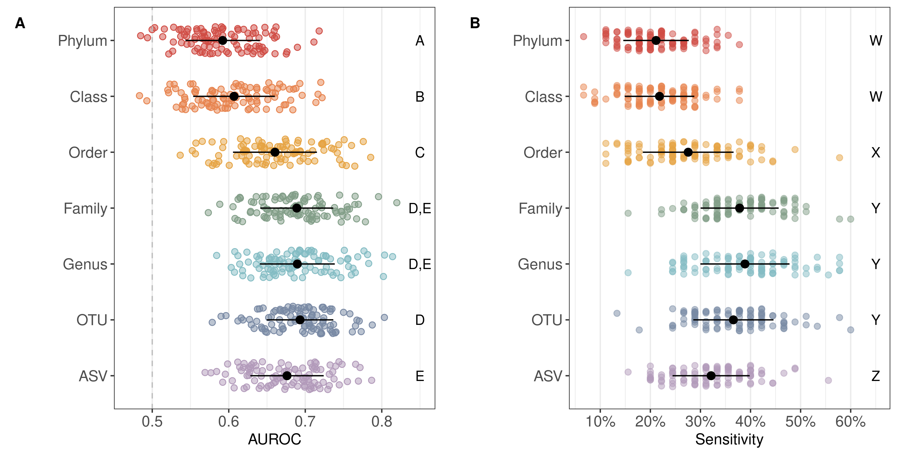
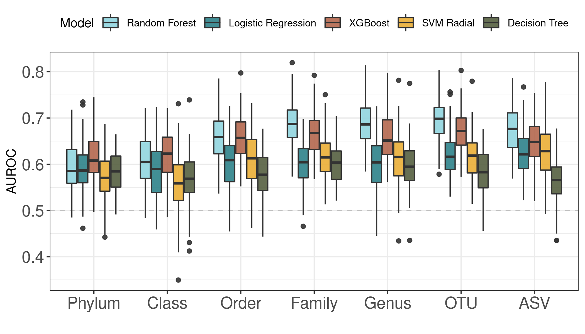
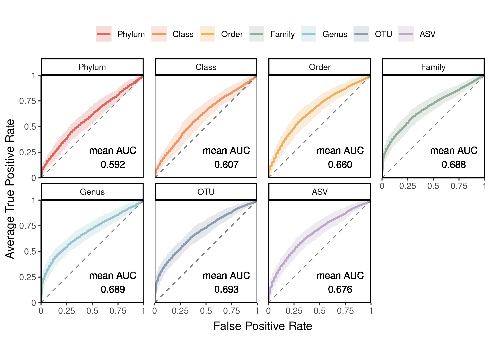
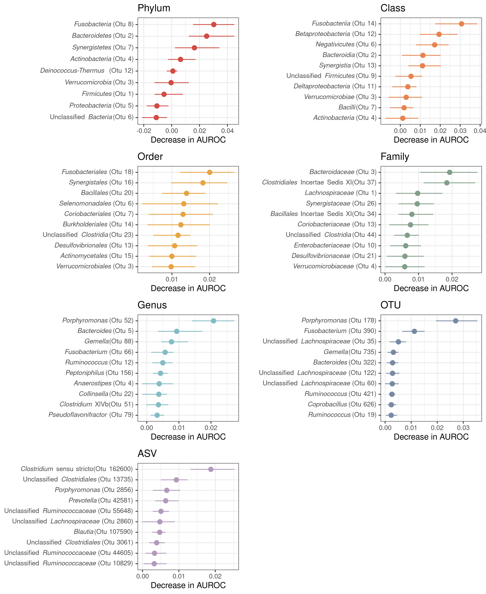

```{r setup_environment, include=FALSE}
knitr::opts_chunk$set(echo = FALSE,message=FALSE)
options(scipen=999)
library(tidyverse)
library(kableExtra)
library(schtools)
```

# Taxonomic Resolution Matters for Microbiome-Based Classification of Colorectal Cancer

\vspace{10mm}

Courtney R. Armour, Begüm D.Topçuoğlu, Andrea Garretto, Patrick D. Schloss ${^\dagger}$

\vspace{20mm}

${\dagger}$ To whom correspondence should be addressed:

\href{mailto:pschloss@umich.edu}{pschloss@umich.edu}

Department of Microbiology

University of Michigan

Ann Arbor, MI 48109

\vspace{20mm}

**observation format - max 1200 words, 2 figures, 25 ref**

\newpage

## Abstract (max 250 words)

## Importance (max 150 words)

\newpage

Colorectal cancer is one of the most common cancers in men and women and a leading cause of cancer related deaths in the United States [@siegel2020]. Early detection and treatment are essential to increase survival rates, but for a variety of reasons including the invasiveness and high cost of screening (i.e. colonoscopy), many people do not comply with recommended screening guidelines [@garcía2011a] prompting a need for low cost, non-invasive detection methods. A growing body of research points to the gut microbiome as a promising target for non-invasive screening to detect screen relevant neoplasia (SRNs) consisting of pre-cancerous polyps (i.e. advanced adenomas) and carcinomas. Efforts to realize the diagnostic potential of the gut microbiome in detecting SRNs have focused on machine learning (ML) methods using abundances of operational taxonomic unit (OTU) classifications based on amplicon sequencing of the 16S rRNA gene {}. However, whether this is the optimal taxonomic resolution for classifying SRNs from microbiome data is unknown. Additionally, recent work has pushed for the use of amplicon sequence variants (ASVs) to replace OTUs for marker-gene analysis because of the improved resolution with ASVs [@callahan2017]. However, whether the additional resolution provided by ASVs is useful for ML classification is unclear {}. Since ML classification relies on consistent differences between groups, its possible that the resolution at the ASV level is too individualized to accurately differentiate groups. Topçuoğlu *et al* [@topçuolu2020] recently demonstrated how to effectively apply machine learning (ML) methods to microbiome based classification problems and developed a framework for applying ML practices in a more reproducible way (mikropml). This analysis utilizes the reproducible framework developed by Topçuoğlu *et al* to determine which ML method and taxonomic level produce the best performing classifier for detecting SRNs from microbiome data.

```{r median_AUC}
table <- read_csv("../exploratory/figures/median_test_auc.csv",
                  col_types = cols(level=col_character(),
                                   .default=col_double()))

rf_med_auc <- table %>% 
  pull(rf)

names(rf_med_auc) <- table %>% pull(level)
```

```{r input_table}
input <- read_csv("../analysis/input_values.csv",
                  col_types = cols(level=col_character(),
                                   .default = col_double())) %>% 
  mutate(pct_kept = round(n_features_preproc/n_features,digits=3)*100)
```

```{r dada2}
dada2_results <- read_csv("../data/dada2/process/combined-dada2-rf.csv",
                          col_types = cols(method = col_character(),
                                           .default = col_double()))
dada2_med_auc <- dada2_results %>% 
  pull(AUC) %>% 
  median()

dada2_rf_pvals <- read_csv("../data/dada2/analysis/dada2_pvalues_by_model.csv") %>% 
  filter(model == "rf")

```

```{r pvals}
rf_pvals <- read_csv("../analysis/pvalues_by_model.csv",
                     col_types = cols(.default = col_character(),
                                      p_value = col_double())) %>% 
  filter(model == "rf") %>% 
  select(-model) %>% 
  pivot_wider(names_from = "level2",values_from = "p_value") %>% 
  column_to_rownames("level1")

rf_notsig <- read_csv("../analysis/pvalues_by_model.csv",
                     col_types = cols(.default = col_character(),
                                      p_value = col_double())) %>% 
  filter(model == "rf") %>% 
  filter(p_value >= 0.05)
```

Utilizing publicly available 16S rRNA sequence data from stool of patients with SRNs and healthy controls, we generated abundance tables with mothur {} annotated to phylum, class, order, family, genus, OTU and ASV levels. Using the taxonomic abundance data, we quantified how reliably samples could be classified as "normal" or "SRN" (i.e. advanced adenoma or carcinoma) using five machine learning methods with the mikropml R package (methods). Across the five machine learning methods tested, model performance tended to increase with taxonomic level usually peaking around genus/OTU level before dropping off slightly with ASVs (Supplemental Figure 1). Regardless of the taxonomic level, random forest (RF) models consistently had the largest area under the receiver operating characteristic curve (AUROC). Within the RF model, the highest AUROCs were observed for family (median AUROC: `r round(rf_med_auc["family"],digits=3)`), genus (median AUROC: `r round(rf_med_auc["genus"],digits=3)`), and OTU (median AUROC: `r round(rf_med_auc["otu"],digits=3)`) level data with no significant difference between the three (Figure 1A, Supplemental Figure 2). Performance with ASVs (median AUROC: `r round(rf_med_auc["asv"],digits=3)`) was significantly lower than OTUs (p \< 0.01), but comparable to family (p = `r round(rf_pvals["family","asv"],digits=2)`) and genus (p = `r round(rf_pvals["genus","asv"],digits=2)`) levels (Figure 1A). These results suggest that finer taxonomic resolution is not necessarily better for identifying individuals with SRNs based on microbiome composition.

While comparing AUROC values between models is a useful way to assess the overall model performance, they summarize the performance across all thresholds and can be misleading since models with the same AUC can have different ROC curve shapes [@lobo2008]. Depending on the intended implementation of the model, one may want to optimize the true-positive rate (or sensitivity) over the false-positive rate (or 1-specificity), or vice versa. In this case, the optimal model will detect as many true positives (people with SRNs) as possible. To further compare the model performance across taxonomic levels we compared the sensitivity of the models at a specificity of 90%. The highest sensitivity values were observed for family, genus, and OTU level data (Figure 1B), consistent with the AUROC results. phylum, class, order, and ASV sensitivity values were all significantly lower than family, genus, and OTU sensitivity values (Figure 1B). This analysis further supports the observation that finer resolution is does not improve SRN detection.

One hypothesis for the observation that model performance increases from phylum to OTU level then drops slightly at ASV level is that at higher taxonomic levels (e.g. phylum) there are too few taxa and too much overlap to reliably differentiate between cases and controls. At the level of genus or OTU there is enough data and variation but at the ASV level, the data is too specific to individuals and does not overlap enough. Examination of the prevalence of taxa in samples at each level supports this idea. A majority of taxa were present in greater than 75% of samples at the phylum (67% of taxa) and class (63% of taxa) levels. The opposite was observed at the OTU and ASV level where 60% and 53% of taxa respectively were only present in less than 25% of samples (Supplemental Figure 3). Of note, the ML pipeline includes a pre-processing step that occured prior to training and classifying the ML models. As part of this step, taxa were removed that would not provide useful information to build the model. For example, perfectly correlated taxa provide the same information to build the model and thus can be collapsed. Additionally, features with zero or near-zero variance across samples would not help the model differentiate groups and thus can be removed. Interestingly, despite starting with `r format_number(input %>% filter(level == "asv") %>% select(n_features) %>% pull())` ASVs, only `r input %>% filter(level == "asv") %>% select(n_features_preproc) %>% pull()` (`r input %>% filter(level == "asv") %>% select(pct_kept) %>% pull()`%) remained after pre-processing. At the OTU level, `r input %>% filter(level == "otu") %>% select(n_features_preproc) %>% pull()` of the `r format_number(input %>% filter(level == "otu") %>% select(n_features) %>% pull())` OTUs (`r input %>% filter(level == "otu") %>% select(pct_kept) %>% pull()`%) remained after preprocessing (Table 1). While the resolution provided by ASVs is useful in certain contexts {}, these results suggest that the resolution is too fine for use in machine learning classification of SRNs based on microbiome composition.

A look into the most important taxa at each level for classifying samples revealed some nesting where several genera and their higher taxonomic classifications were in the top 10 most important taxa (Supplemental Figure 4). For example, the genus *Gemella* was an important taxon at the genus and OTU levels and its higher classifications were also important (*Firmicutes* > *Bacilli* > *Bacillales* > *Bacillales Incertae Sedis XI* > *Gemella*). *Fusobacterium* displayed a similar pattern, except that the family level classification (*Fusobacteriaceae*) importance was ranked 16th out of 54 families. In the case of unclassified *Lachnospiraceae*, there were several OTUs with this label that were in the top 10, however at the genus level this taxon was ranked lower in importance (21st out of 115 genera) suggesting there may be some benefit to separating different taxonomic groupings within *Lachnospiraceae*.

These results demonstrate that consideration of the appropriate taxonomic resolution for utilizing the microbiome as a predictive tool is warranted. In general, we found that finer taxonomic resolution (e.g. OTU and ASV) did not add additional sensitivity to predicting SRNs based on microbiome composition. Additionally, at the ASV level the fine resolution actually impedes model performance due to the sparsity of shared taxa and led to decreased model performance. The tendancy for ASV level annotation to split single bacterial genomes into multiple taxa {Pat mSphere 2021} could also be a contributing factor to the sparsity of shared taxa. Overall, either family, genus, or OTU level taxonomy appear to perform equally for predicting subjects with SRNs based on the composition of the gut microbiome. A potential benefit of utilizing genus or family level data could be that it may allow for merging data generated from different 16S rRNA gene regions or sequencing platforms.

## Materials and Methods

***Dataset.*** Raw 16S rRNA gene amplicon sequence data isolated from human gut samples {Baxter} was downloaded from NCBI SRA (accession \#). This dataset contains stool samples from 490 subjects. Based on the available metadata, samples categorized as normal, high risk normal, or adenoma were labeled "normal" for this analysis and samples categorized as advanced adenoma or carcinoma were labeled as "screen relevant neoplasia" (SRN). This resulted in a total of 261 "normal" samples and 229 "SRN" samples.

***Data processing.*** Sequence data was processed with mothur (1.44.3) using the SILVA reference database (v132) to produce count tables for phylum, class, order, family, genus, OTU, and ASV following the Schloss Lab MiSeq SOP described on the mothur website. ASV level data was also produced using DADA2 to ensure consistent results with a different pipeline. Data was processed following the DADA2 pipeline, but setting pool=TRUE to infer ASVs from the whole dataset rather than per sample. The resulting ASV table was subsampled for consistency with the mothur data. These results were consistent for ASVs generated with DADA2 [@callahan2016] (median AUROC: `r round(dada2_med_auc,digits=3)`).

***Machine Learning.*** Machine learning models were run with the R package mikropml (v0.0.2) {} to predict the diagnosis category (normal vs SRN) of each sample. Data was preprocessed to normalize values (scale/center), remove values with zero or near-zero variance, and collapse collinear features using default parameters. Initially the models were run with default hyperparameters, but were expanded if the peak performance was at the edge of the hyperparameter range. Each taxonomic model taxonomic level combination (e.g. random forest on genus) was run with 100 different seeds. Each seed split the data into a training (80%) and testing (20%) set, and output performance of the training and testing as area under the receiver operating curve (AUROC).

To compare performance between taxonomic levels and models, P values were calculated as previously described {begum}. To compare sensitivity at 90% specificity, probabilities on the test dataset were collected for each seed and used to construct ROC curves (R pROC::roc). From the ROC curves The sensitivity at a specificity of 90% was pulled for each seed. An optional output from the mikropml package is the permuted feature importance which is quantified by iteratively permuting each feature in the model and assessing the change in model performance. Features are presumed to be important if the performance of the model, measured by the AUROC, decreases when that feature is permuted. Ranking of feature importance was determined by ordering the features based on the change in AUROC where features with a larger decrease in AUROC are ranked higher in importance.

To quantify prevalence of the features, the number of samples with non-zero abundance was divided by the total number of samples resulting in values ranging from 0 to 1 where 0 indicates the feature is not found in any samples, 0.5 indicates the feature is found in half of the samples, an 1 indicating the feature is found in all of the samples.

All code is available at: **TODO: link to code**

## Acknowledgements

\newpage

## Figures



**Figure 1: Random Forest Model Performance.** **A)** Boxplots with points of area under the receiver operating characteristic curve (AUROC) values on the test dataset for 100 seeds predicting SRNs using a Random Forest model. Dashed line denotes AUROC of 0.5 which is equivalent to random classification. Significance between taxonomic levels was quantified by comparing the difference in mean AUROC and is denoted by letters A through E on the right side of the plot; taxonomic levels with the same letter are in the same significance group and are not significantly different from one another. **B)** Strip plot of the sensitivity at a specificity of 90% across the 100 model iterations. Black points denote the median and the lines denote the IQR. The letters W through Z denote the significance groups.

\newpage

## Tables

```{r feature_counts}

read_csv("table_1.csv") %>%
  select(-n_samples) %>%
  mutate(pct_kept=round((n_features_preproc/n_features)*100,digits=1)) %>%
  mutate(pct_kept=paste0(pct_kept," %"),
         n_features = unlist(lapply(n_features,format_number)),
         level=factor(level,levels=c("phylum","class","order","family","genus","otu","asv" ),
                      labels=c("Phylum","Class","Order","Family","Genus","OTU","ASV"))) %>%
  knitr::kable(format="markdown",booktabs=T,escape=F,align="lrrc",
               linesep="",
               col.names = linebreak(c("Taxonomic Level",
                                 "Number of Features",
                                 "Number of Features \n After Preprocessing",
                                 "Percent of Features Kept \n After Preprocessing"),align="c"))

```

**Table 1: Summary of Features.** Overview of the number of features at each taxonomic level before and after preprocessing as described in the methods.

\newpage

## Supplemental Figures



**Supplemental Figure 1: Model Performance across Taxonomy.** Boxplot of AUROC values on the test dataset for 100 seeds for each model type across all taxonomic levels.

\newpage

{height="50%"}

**Supplemental Figure 2: Averaged ROC curves** ROC curves averaged across the 100 iterations of the model. The shaded region represents the standard deviation form the mean.

\newpage  

{height="45%"}\
**Supplemental Figure 3: Prevalence of Taxa in Samples.** Distribution of taxa prevalence in samples at each taxonomic level.

\newpage

{height="85%"}\
**Supplemental Figure 4: Top 10 important taxa at each taxonomic level.** Summary of the 10 most important taxa for the random forest models at each taxonomic level based on the average decrease in AUC when the feature is permuted.

\newpage

## References
